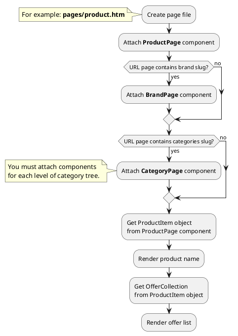

# Examples: Offer

[Back to modules](modules/home.md)
/ [Home](modules/offer/home.md)
/ [Model](modules/offer/model/model.md)
/ [Item](modules/offer/item/item.md)
/ [Collection](modules/offer/collection/collection.md)
/ [Events](modules/offer/event/event.md)
/ Examples
/ [Extending](modules/offer/extending/extending.md)

!> **Attention!** We recommend that you read [Architecture](home.md#architecture), [ElementItem class](item-class/item-class.md),
[ElementCollection class](collection-class/collection-class.md) sections for complete understanding of  project architecture.

* [Example 1: Product page](#example-1-product-page)
* [Example 2: Product card](#example-2-product-card)

## Example 1: Product page

### 1.1 Task

Create simple product page and render select with offers. Render block with offer price and currency.

### 1.2 How can i do it?



### 1.3 Source code
<!-- tabs:start -->
#### ** Variant 1 **

Simple example of product page. Page URL does not contain category slug.

File: **pages/product.htm**
```twig
title = "Product page"
url = "/product/:slug"
layout = "main"
is_hidden = 0

[ProductPage]
slug = "{{ :slug }}"
slug_required = 1
==

{# Get product item #}


<div data-id="{{ obProduct.id }}" itemscope itemtype="http://schema.org/Product">
    <h1 itemprop="name">{{ obProduct.name }}</h1>
</div>
{# Get first offer object #}

{# Render price block #}
<div>
    <span itemprop="priceCurrency" content="{{ obOffer.currency_code }}">{{ obOffer.currency }}</span>
    <span itemprop="price">{{ obOffer.price }}</span>
</div>
{# Render old price block #}

    <div>
        <span itemprop="priceCurrency" content="{{ obOffer.currency_code }}">{{ obOffer.currency }}</span>
        <span itemprop="price">{{ obOffer.old_price }}</span>
    </div>

{# Get offer list #}

{# Render select with offers #}

    <select>
        
            <option value="{{ obOffer.id }}">{{ obOffer.name }}</option>
        
    </select>

```
#### ** Variant 2 **

Simple example of product page. Page URL contains category slug.

> This example is suitable for **2-level** catalog.

File: **pages/product.htm**
```twig
title = "Product page"
url = "/catalog/:main_category/:category/:slug"
layout = "main"
is_hidden = 0

[ProductPage]
slug = "{{ :slug }}"
slug_required = 1
smart_url_check = 1

[CategoryPage]
slug = "{{ :category }}"
slug_required = 1

[CategoryPage ParentCategoryPage]
slug = "{{ :main_category }}"
slug_required = 1
==

{# Get product item #}


<div data-id="{{ obProduct.id }}" itemscope itemtype="http://schema.org/Product">
    <h1 itemprop="name">{{ obProduct.name }}</h1>
</div>
{# Get first offer object #}

{# Render price block #}
<div>
    <span itemprop="priceCurrency" content="{{ obOffer.currency_code }}">{{ obOffer.currency }}</span>
    <span itemprop="price">{{ obOffer.price }}</span>
</div>
{# Render old price block #}

    <div>
        <span itemprop="priceCurrency" content="{{ obOffer.currency_code }}">{{ obOffer.currency }}</span>
        <span itemprop="price">{{ obOffer.old_price }}</span>
    </div>

{# Get offer list #}

{# Render select with offers #}

    <select>
        
            <option value="{{ obOffer.id }}">{{ obOffer.name }}</option>
        
    </select>

```

#### ** Variant 3 **

Simple example of product page. Page URL contains category and brand slug.

> This example is suitable for **2-level** catalog.

File: **pages/product.htm**
```twig
title = "Product page"
url = "/catalog/:main_category/:category/:brand/:slug"
layout = "main"
is_hidden = 0

[ProductPage]
slug = "{{ :slug }}"
slug_required = 1
smart_url_check = 1

[BrandPage]
slug = "{{ :brand }}"
slug_required = 1

[CategoryPage]
slug = "{{ :category }}"
slug_required = 1

[CategoryPage ParentCategoryPage]
slug = "{{ :main_category }}"
slug_required = 1
==

{# Get product item #}


<div data-id="{{ obProduct.id }}" itemscope itemtype="http://schema.org/Product">
    <h1 itemprop="name">{{ obProduct.name }}</h1>
</div>
{# Get first offer object #}

{# Render price block #}
<div>
    <span itemprop="priceCurrency" content="{{ obOffer.currency_code }}">{{ obOffer.currency }}</span>
    <span itemprop="price">{{ obOffer.price }}</span>
</div>
{# Render old price block #}

    <div>
        <span itemprop="priceCurrency" content="{{ obOffer.currency_code }}">{{ obOffer.currency }}</span>
        <span itemprop="price">{{ obOffer.old_price }}</span>
    </div>

{# Get offer list #}

{# Render select with offers #}

    <select>
        
            <option value="{{ obOffer.id }}">{{ obOffer.name }}</option>
        
    </select>

```
<!-- tabs:end -->

## Example 2: Product card

### 2.1 Task
Create simple product card and render product name, preview_image, preview_text fields.
Render link on product page. Render block with offer price and currency.

> **"obProduct"** is object of [ProductItem](modules/product/item/item.md#productitem) class.

### 2.2 Source code

Simple example of product card.

File: **partials/product/product-card/product-card.htm**
```twig
<a href="{{ obProduct.getPageUrl() }}">
    <div itemscope itemtype="http://schema.org/Product">
        
            
        
        <h3 itemprop="name">{{ obProduct.name }}</h3>
        
            <div itemprop="description">
                {{ obProduct.preview_text }}
            </div>
        
        {# Get first offer object #}
        
        {# Render price block #}
        <div>
            <span itemprop="priceCurrency" content="{{ obOffer.currency_code }}">{{ obOffer.currency }}</span>
            <span itemprop="price">{{ obOffer.price }}</span>
        </div>
        {# Render old price block #}
        
            <div>
                <span itemprop="priceCurrency" content="{{ obOffer.currency_code }}">{{ obOffer.currency }}</span>
                <span itemprop="price">{{ obOffer.old_price }}</span>
            </div>
        
    </div>
</a>
```

[Back to modules](modules/home.md)
/ [Home](modules/offer/home.md)
/ [Model](modules/offer/model/model.md)
/ [Item](modules/offer/item/item.md)
/ [Collection](modules/offer/collection/collection.md)
/ [Events](modules/offer/event/event.md)
/ Examples
/ [Extending](modules/offer/extending/extending.md)