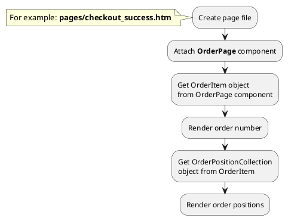
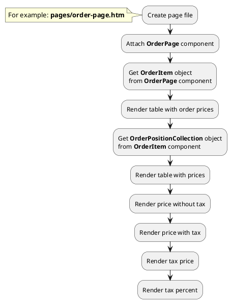




* [Example 1: Order page](#example-1-order-page)
* [Example 2: Render tax price of order](#example-2-render-tax-price-of-order)

## Example 1: Order page

### 1.1 Task

Create simple "Thank you" page with order number and order positions.

### 1.2 How can i do it?



### 1.3 Source code

File: **pages/checkout_success.htm**

```twig
title = "Thank you page"
url = "/checkout/:slug"
layout = "main"

[OrderPage]
slug = "{{ :slug }}"
==

{# Get order object #}

<div data-id="{{ obOrder.id }}">
    <h1>{{ obOrder.order_number }}</h1>
    {# Get order positions #}
    
    
      
      
      <div>
        <div>{{ obProduct.name }}</div>
        <div>{{ obOrderPosition.quantity }}</div>
        <div>{{ obOrderPosition.price }} {{ obOrderPosition.currency_symbol }}</div>
      </div>
    
</div>
```


## Example 2: Render tax price of order

### 2.1 Task

Create simple order page and render price block. Get prices of order positions with tax and without tax.

### 2.2 How can i do it?



### 2.3 Source code

{{ get_module('tax').example('pages/order-page-1.htm')|raw }}

{{ get_module('tax').example('partials/order/order-position/order-position-1.htm')|raw }}


