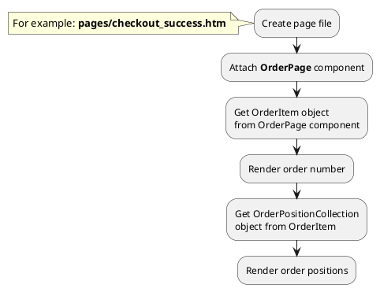

[Back to modules](modules/home.md)

[Home](modules/order-position/home.md)
• [Model](modules/order-position/model/model.md)
• [Item](modules/order-position/item/item.md)
• [Collection](modules/order-position/collection/collection.md)
• Examples
• [Extending](modules/order-position/extending/extending.md)

# Examples: OrderPosition {docsify-ignore-all}

!> **Attention!** We recommend that you read [Architecture](architecture/architecture), [ElementItem class](architecture/item-class/item-class.md),
[ElementCollection class](architecture/collection-class/collection-class.md) sections for complete understanding of  project architecture.

* [Example 1: Order page](#example-1-order-page)

## Example 1: Order page

### 1.1 Task

Create simple "Thank you" page with order number and order positions.

### 1.2 How can i do it?



### 1.3 Source code

File: **pages/checkout_success.htm**
```twig
title = "Thank you page"
url = "/checkout/:slug"
layout = "main"

[OrderPage]
slug = "{{ :slug }}"
==

{# Get order object #}

<div data-id="{{ obOrder.id }}">
    <h1>{{ obOrder.order_number }}</h1>
    {# Get order positions #}
    
    
      
      
      <div>
        <div>{{ obProduct.name }}</div>
        <div>{{ obOrderPosition.quantity }}</div>
        <div>{{ obOrderPosition.price }} {{ obOrderPosition.currency_symbol }}</div>
      </div>
    
</div>
```

[Home](modules/order-position/home.md)
• [Model](modules/order-position/model/model.md)
• [Item](modules/order-position/item/item.md)
• [Collection](modules/order-position/collection/collection.md)
• Examples
• [Extending](modules/order-position/extending/extending.md)

[Back to modules](modules/home.md)
