[Back to modules](modules/home.md)

[Home](modules/order/home.md)
• [Model](modules/order/model/model.md)
• [Item](modules/order/item/item.md)
• [Collection](modules/order/collection/collection.md)
• Components
<!--
• [Events](modules/order/event/event.md)
• [Examples](modules/order/examples/examples.md)
• [Extending](modules/order/extending/extending.md)
-->

# Components {docsify-ignore-all}

!> **Attention!**  We recommend that you read [Architecture](home.md#architecture), [ElementItem class](item-class/item-class.md),
[ElementCollection class](collection-class/collection-class.md) sections for complete understanding of  project architecture.

* [MakeOrder](#makeorder)
* [OrderPage](#orderpage)
  * [get](#get)
  * [onPurchase](#onpurchase)

## MakeOrder

Component allows you to create orders.

**Component properties:**
  - Mode (Submit form/Ajax form)
  - Send flash message (only for Ajax mode)
  - Enable redirect
  - Choose page for redirect (order ID and order number will be passed to page URL)
  
#### How it works?

```plantuml
@startuml
start
:Component gets order fields
from **"order" field in request**;
:Component gets user fields
from **"user" field in request**;
:Gets authorized user;
if (Need creates new user?) then (yes)
    :Find user by email;
    if (User found?) then (yes)
    else (no)
        :Fire event to find user
         with using your custom logic;
        note left
            shopaholic.order.find_user_before_create
        end note
    endif
    if (User found?) then (yes)
    else (no)
        :Generate random password
        for new user;
        :Generate fake email if needed;
        :Creates new user;
        if (Has validation errors?) then (no)
            :Fire event that new user was created;
            note left
                shopaholic.order.user_created
            end note
        else (yes)
            (A)
            detach
        endif
    endif
else (no)
endif
:Get cart object;
:Megre user data from request
and cart data crom cart object;
:Component gets shipping address
fields from **"shipping_address"**
in request;
:Megre shipping address data from request
and shipping address data crom cart object;
:Creates new shipping address or
updates user shipping address;
if (Has validation errors?) then (no)
else (yes)
    (A)
    detach
endif
:Component gets billing address
fields from **"billing_address"**
in request;
:Megre billing address data from request
and billing address data crom cart object;
:Creates new billing address or
updates user billing address;
if (Has validation errors?) then (no)
else (yes)
    (A)
    detach
endif
:Gets active currecncy;
:Merge user data, 
shipping address data,
billing address data with
order properties;
:Component gets payment data
fields from **"payment"** field
in request;
:Attach user to order;
:Set order status as "New";
:Fire event before order will be created;
note right
    shopaholic.order.update_data
end note
:Fire event that gets of calculated
shipping price;
note right
    shopaholic.order.get_shipping_price
end note
if (Shipping price is empty?) then (yes)
    :Get shipping type object;
    if (Shipping type has api class?) then (yes)
        :Gets shipping price from
        api class;
        :Saving shipping price in order data;
    else (no)
        :Saving shipping price in order data
        from shipping type object;
    endif 
else (no)
    :Saving of calulated shipping price in order data; 
endif
:Init cart positions
from cart object;
:Validate cart positions;
:Start DB transaction;
:Fire event before order will be created;
note right
    shopaholic.order.before_create
end note
:Creates order object
and order positions;
if (Has validation errors?) then (no)
else (yes)
    :RollBack DB transaction;
    (A)
    detach
endif
:Fire event after order creation;
note right
    shopaholic.order.after_create
end note
:Attach promo mechanisms to order object;
:Commit DB transaction; 
:Fire event after order creation;
note right
    shopaholic.order.created
end note
:Fire event for receiving URL
for redirect after successful
order creation;
note right
    shopaholic.order.get_redirect_url
end note
if (Redirect URL is empty?) then (yes)
    :Check payment gateway;
    if (Payment gateway has redirect URL?) then (yes)
        :Redirects user to payment gateway;
    else (no)
        :Gets redirect URL from component properties;
        :Redirects user to "Thank you" page;
    endif
else (no)
    :Redirects user to "Thank you" page;
endif
stop

(A)
:Return response with error message;
stop
@enduml
```



### Example 1: Make order with using ajax request

#### Request

```javascript
let data = {
    'order': {
        'payment_method_id': 1,
        'shipping_type_id': 2,
        'shipping_price': 10.5,
        'property': {
            'address': '...',
            'city': 'Minsk'
        }
    },
    'user': {
        'email': 'test@test.com',
        'name': 'Andrey'
    },
    'shipping_address': {
        'id': 10  //Address data of user with ID == 10 will be save in order
    },
    'billing_address': {
        //New billing address will be created for user.
        'country': 'Belarus',
        'address1': 'test 1',
        'address2': 'test 2'
    }
};

$.request('MakeOrder::onCreate', {
    'data': data
});
```

<details>
<summary>Click to see positive response example</summary>

```json
{
"status": true,
"code": null,
"message": null,
"data": {
    "id": 4,
    "number": "20191216-0001",
    "key": "268b433fec9ec645581a5db71215aca1"
  }
}
```

</details>

<details>
<summary>Click to see negative response example</summary>

```json
{
"status": false,
"code": "Error code",
"message": "Error message",
"data": {}
}
```

</details>

### **Example 2** Make order with submit form

```html
title = "Checkout"
url = "/checkout"
layout = "main"

[MakeOrder]
mode="submit"
redirect_on=1
redirect_page="order_success"

[PaymentMethodList]

[ShippingTypeList]
==




<form href="{{ 'order'|page }}">
    <label for="field-email">Email</label>
    <input type="email" id="field-email" placeholder="Email" name="user[email]" value="{{ arForm.user.email }}">
    
        <p>{{ arError.message }}</p>
    
    
    <label for="field-company-name">Company name</label>
    <input type="text" id="field-company-name" placeholder="My company" name="user[property][company_name]" value="{{ arForm.user.property.company_name }}">
    
    
    
        <div class="payment-method-list-wrapper">
            
                <input type="radio" name="order[payment_method_id]" id="payment-{{ obPaymentMethod.id }}" value="{{ obPaymentMethod.id }}">
                <label for="payment-{{ obPaymentMethod.id }}">{{ obPaymentMethod.name }}</label>
            
        </div>
    
    
    
    
        <div class="payment-method-list-wrapper">
            
                <input type="radio" name="order[shipping_type_id]" id="payment-{{ obShippingType.id }}" value="{{ obShippingType.id }}">
                <label for="payment-{{ obShippingType.id }}">{{ obShippingType.name }}</label>
            
        </div>
    
    
    <input type="hidden" name="order[shipping_price]" value="5.50">
    <button type="submit">Submit</button>
</form>

    <p>{{ arError.message }}</p>


```

## OrderPage

Component allows to display "Thank you" page with data of new orders.

Available properties:

|Property|Available values|Description|
|---|---|---|
|slug|{{ :slug }}|URL parameter from page settings|
|slug_required|0 or 1|If value is 1, component will generate 404 page, if "slug" parameter is empty|

### get()

Method returns [OrderItem](modules/order/item/item.md#orderitem) object for current page.

```twig
title = "Thank you page"
url = "/checkout/:slug"
layout = "main"

[OrderPage]
slug = "{{ :slug }}"
==

{# Get order object #}

<div data-id="{{ obOrder.id }}">
    <h1>{{ obOrder.order_number }}</h1>
</div>
```

### onPurchase()

Method adds ability to send purchase request to payment gateway from order page.

<details>
<summary>Click to see positive response example</summary>

```json
{
"status": true,
"code": null,
"message": null,
"data": {}
}
```

</details>

<details>
<summary>Click to see negative response example</summary>

```json
{
"status": false,
"code": "Error code",
"message": "Error message",
"data": {}
}
```

</details>

[Home](modules/order/home.md)
• [Model](modules/order/model/model.md)
• [Item](modules/order/item/item.md)
• [Collection](modules/order/collection/collection.md)
• Components
<!--
• [Events](modules/order/event/event.md)
• [Examples](modules/order/examples/examples.md)
• [Extending](modules/order/extending/extending.md)
-->
[Back to modules](modules/home.md)