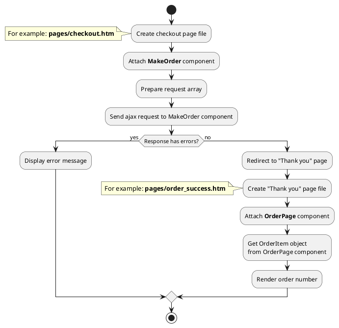
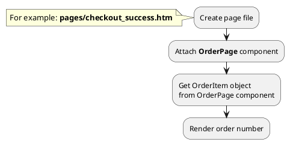
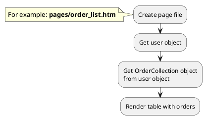
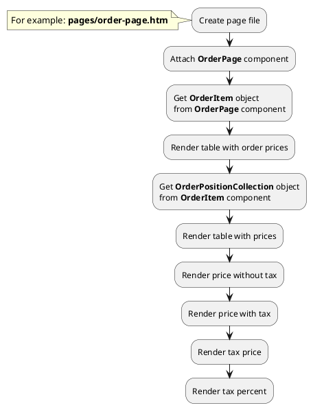




* [Example 1: Make order](#example-1-make-order)
* [Example 2: Order page](#example-2-order-page)
* [Example 3: User order list](#example-3-user-order-list)
* [Example 4: Render tax price of order](#example-4-render-tax-price-of-order)

## Example 1: Make order

### 1.1 Task

Make order with using ajax request and redirect user to "Thank you" page.

### 1.2 How can i do it?

> Example uses {{ component.link('make-order') }} and {{ component.link('order-page') }} components.
{{ component.link('order-page') }} component method returns {{ item.link() }} class object.
All available fields and methods of **OrderItem** class you can find in {{ item.link('section') }}



### 1.3 Source code

File: **pages/checkout.htm**

```twig
title = "Checkout"
url = "/checkout"
layout = "main"
is_hidden = 0

[MakeOrder]
mode = "ajax"
redirect_on = 1
redirect_page = "success"

[ShippingTypeList]

[PaymentMethodList]
==
<form>
  <div>
    <label for="name">Your name</label>
    <input type="text" id="name" name="name">
  </div>
  <div>
    <label for="phone">Contact phone</label>
    <input type="text" id="phone" name="phone">
  </div>
  <div>
    <label for="email">Email</label>
    <input type="text" id="email" name="email">
  </div>
  <div>
    <label for="address">Address</label>
    <input type="text" id="address" name="address">
  </div>
  
  {# Render shipping types #}
  
  
  <div>
    <span>Choose shipping type:</span>
    
      <input type="radio" id="shipping-type-{{ obShippingType.id }}" name="shipping_type" value="{{ obShippingType.id }}">
      <label for="shipping-type-{{ obShippingType.id }}">{{ obShippingType.name }}</label>
    
  </div>
  
  
  {# Render payment methods #}
  
  
  <div>
    <span>Choose payment method:</span>
    
      <input type="radio" id="payment-method-{{ obPaymentMethod.id }}" name="payment_method" value="{{ obPaymentMethod.id }}">
      <label for="payment-method-{{ obPaymentMethod.id }}">{{ obPaymentMethod.name }}</label>
    
  </div>
  
</form>
```


Prepare request array and send AJAX request to MakeOrder component
```javascript
let data = {
    'order': {
        'payment_method_id': ...,     //Get value from radio button with name="payment_method"
        'shipping_type_id': ...,      //Get value from radio button with name="shipping_type"
        'property': {
            'address': '...',         //Get value from input with name="address"
        }
    },
    'user': {
        'email': ...,                 //Get value from input with name="email"
        'name': ...,                  //Get value from input with name="name"
        'phone': ...,                 //Get value from input with name="phone"
    }
};

$.request('MakeOrder::onCreate', {
    'data': data,
    success: function(obResponse) {
      if (!obResponse) {
        return;
      }
      
      if (!!obResponse['X_OCTOBER_REDIRECT']) {
        return this.success(obResponse);  
      }
      
      if (!obResponse.status) {
        //Show message with error
        ...
        return;
      }
      
      //Show "Success message"
      ...
      return this.success(obResponse);
    }
});
```

File: **pages/success.htm**

```twig
title = "Thank you page"
url = "/checkout/:slug"
layout = "main"

[OrderPage]
slug = "{{ :slug }}"
==

{# Get order object #}

<div data-id="{{ obOrder.id }}">
    <h1>{{ obOrder.order_number }}</h1>
</div>
```


## Example 2: Order page

### 2.1 Task

Create simple "Thank you" page with order number.

### 2.2 How can i do it?



### 2.3 Source code

File: **pages/checkout_success.htm**

```twig
title = "Thank you page"
url = "/checkout/:slug"
layout = "main"

[OrderPage]
slug = "{{ :slug }}"
==

{# Get order object #}

<div data-id="{{ obOrder.id }}">
    <h1>{{ obOrder.order_number }}</h1>
</div>
```


## Example 3: User order list

### 3.1 Task

Render table with user order list.

> Block with user order list can be complicated (contain searching, filtering, sorting, pagination).

### 3.2 How can i do it?



### 3.3 Source code

<!-- tabs:start -->
#### ** Lovata.Buddies **

File: **pages/order_list.htm**

```twig
title = "User order list"
url = "/user/order"
layout = "main"
is_hidden = 0

[UserData]

[UserPage]
slug = ""
slug_required = 0
mode = "ajax"
flash_on = 0
redirect_on = 1
redirect_page = "user_profile"
login_page = "login"
==

{# Get user object #}


{# Get OrderCollection object from user object #}


  <table>
    <caption>Order list</caption>
    <tr>
      <th>Order number</th>
      <th>Status</th>
      <th>Total price</th>
    </tr>
    
      <tr>
        <td>{{ obOrder.order_number }}</td>
        <td>{{ obOrder.status.name_for_user }}</td>
        <td>{{ obOrder.total_price }} {{ obOrder.currency_symbol }}</td>
      </tr>
    
    </table>

  <div>You have no orders yet</div>

```


#### ** RainLab.User **

File: **pages/order_list.htm**

```twig
title = "Index page"
url = "/"
layout = "main"
is_hidden = 0
==


  {# Get OrderCollection object from user object #}
  
  
    <table>
      <caption>Order list</caption>
      <tr>
        <th>Order number</th>
        <th>Status</th>
        <th>Total price</th>
      </tr>
      
        <tr>
          <td>{{ obOrder.order_number }}</td>
          <td>{{ obOrder.status.name_for_user }}</td>
          <td>{{ obOrder.total_price }} {{ obOrder.currency_symbol }}</td>
        </tr>
      
      </table>
  
    <div>You have no orders yet</div>
  

    <p>Nobody is logged in</p>

```

<!-- tabs:end -->

## Example 4: Render tax price of order

### 4.1 Task

Create simple order page and render price block. Get prices of order positions with tax and without tax.

### 4.2 How can i do it?



### 4.3 Source code

{{ get_module('tax').example('pages/order-page-1.htm')|raw }}

{{ get_module('tax').example('partials/order/order-position/order-position-1.htm')|raw }}
