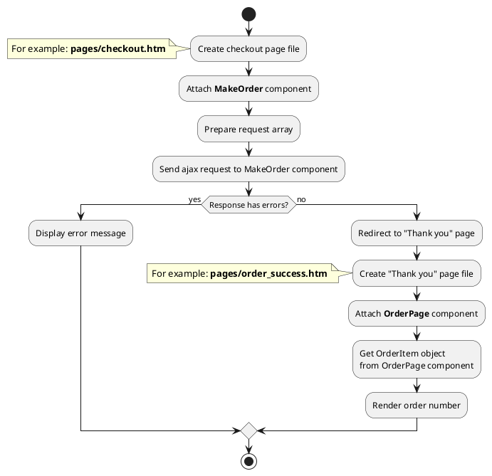

[Back to modules](modules/home.md)

[Home](modules/order/home.md)
• [Model](modules/order/model/model.md)
• [Item](modules/order/item/item.md)
• [Collection](modules/order/collection/collection.md)
• [Components](modules/order/component/component.md)
• [Events](modules/order/event/event.md)
• Examples
• [Extending](modules/order/extending/extending.md)

# Examples: Order {docsify-ignore-all}

!> **Attention!** We recommend that you read [Architecture](home.md#architecture), [ElementItem class](item-class/item-class.md),
[ElementCollection class](collection-class/collection-class.md) sections for complete understanding of  project architecture.

* [Example 1: Make order](#example-1-make-order)

## Example 1: Make order

### 1.1 Task

Make order with using ajax request and redirect user to "Thank you" page.

### 1.2 How can i do it?

> Example uses [MakeOrder](modules/order/component/component.md#makeorder) and [OrderPage](modules/order/component/component.md#orderpage) components.
[OrderPage](modules/order/component/component.md#orderpage) component method returns [OrderItem](modules/order/item/item.md#orderitem) class object.
All available fields and methods of **OrderItem** class you can find in [section](modules/order/item/item.md#orderitem)

### 1.3 Source code

[Home](modules/order/home.md)
• [Model](modules/order/model/model.md)
• [Item](modules/order/item/item.md)
• [Collection](modules/order/collection/collection.md)
• [Components](modules/order/component/component.md)
• [Events](modules/order/event/event.md)
• Examples
• [Extending](modules/order/extending/extending.md)

[Back to modules](modules/home.md)
