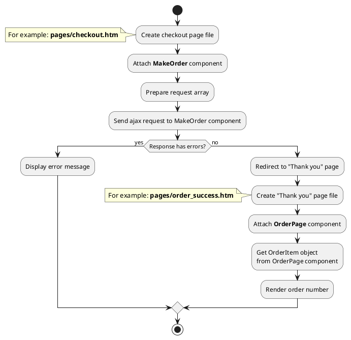

## Example {{ i }}: Make order

### {{ i }}.1 Task

Make order with using ajax request and redirect user to "Thank you" page.

### {{ i }}.2 How can i do it?

> Example uses {{ component.link('make-order') }} and {{ component.link('order-page') }} components.
{{ component.link('order-page') }} component method returns {{ item.link() }} class object.
All available fields and methods of **OrderItem** class you can find in {{ item.link('section') }}



### {{ i }}.3 Source code

File: **pages/checkout.htm**

```twig
title = "Checkout"
url = "/checkout"
layout = "main"
is_hidden = 0

[MakeOrder]
mode = "ajax"
redirect_on = 1
redirect_page = "success"

[ShippingTypeList]

[PaymentMethodList]
==
<form>
  <div>
    <label for="name">Your name</label>
    <input type="text" id="name" name="name">
  </div>
  <div>
    <label for="phone">Contact phone</label>
    <input type="text" id="phone" name="phone">
  </div>
  <div>
    <label for="email">Email</label>
    <input type="text" id="email" name="email">
  </div>
  <div>
    <label for="address">Address</label>
    <input type="text" id="address" name="address">
  </div>
  
  {# Render shipping types #}
  
  
  <div>
    <span>Choose shipping type:</span>
    
      <input type="radio" id="shipping-type-{{ obShippingType.id }}" name="shipping_type" value="{{ obShippingType.id }}">
      <label for="shipping-type-{{ obShippingType.id }}">{{ obShippingType.name }}</label>
    
  </div>
  
  
  {# Render payment methods #}
  
  
  <div>
    <span>Choose payment method:</span>
    
      <input type="radio" id="payment-method-{{ obPaymentMethod.id }}" name="payment_method" value="{{ obPaymentMethod.id }}">
      <label for="payment-method-{{ obPaymentMethod.id }}">{{ obPaymentMethod.name }}</label>
    
  </div>
  
</form>
```


Prepare request array and send AJAX request to MakeOrder component
```javascript
let data = {
    'order': {
        'payment_method_id': ...,     //Get value from radio button with name="payment_method"
        'shipping_type_id': ...,      //Get value from radio button with name="shipping_type"
        'property': {
            'address': '...',         //Get value from input with name="address"
        }
    },
    'user': {
        'email': ...,                 //Get value from input with name="email"
        'name': ...,                  //Get value from input with name="name"
        'phone': ...,                 //Get value from input with name="phone"
    }
};

$.request('MakeOrder::onCreate', {
    'data': data,
    success: function(obResponse) {
      if (!obResponse) {
        return;
      }
      
      if (!!obResponse['X_OCTOBER_REDIRECT']) {
        return this.success(obResponse);  
      }
      
      if (!obResponse.status) {
        //Show message with error
        ...
        return;
      }
      
      //Show "Success message"
      ...
      return this.success(obResponse);
    }
});
```

File: **pages/success.htm**

```twig
title = "Thank you page"
url = "/checkout/:slug"
layout = "main"

[OrderPage]
slug = "{{ :slug }}"
==

{# Get order object #}

<div data-id="{{ obOrder.id }}">
    <h1>{{ obOrder.order_number }}</h1>
</div>
```

