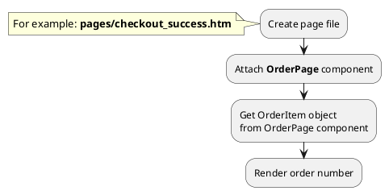

## Example {{ i }}: Order page

### {{ i }}.1 Task

Create simple "Thank you" page with order number.

### {{ i }}.2 How can i do it?



### {{ i }}.3 Source code

File: **pages/checkout_success.htm**

```twig
title = "Thank you page"
url = "/checkout/:slug"
layout = "main"

[OrderPage]
slug = "{{ :slug }}"
==

{# Get order object #}

<div data-id="{{ obOrder.id }}">
    <h1>{{ obOrder.order_number }}</h1>
</div>
```

