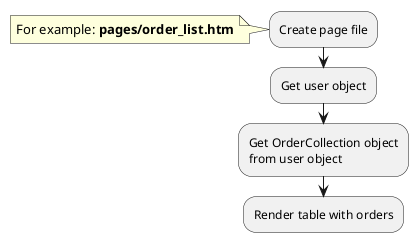

## Example {{ i }}: User order list

### {{ i }}.1 Task

Render table with user order list.

> Block with user order list can be complicated (contain searching, filtering, sorting, pagination).

### {{ i }}.2 How can i do it?



### {{ i }}.3 Source code

<!-- tabs:start -->
#### ** Lovata.Buddies **

File: **pages/order_list.htm**

```twig
title = "User order list"
url = "/user/order"
layout = "main"
is_hidden = 0

[UserData]

[UserPage]
slug = ""
slug_required = 0
mode = "ajax"
flash_on = 0
redirect_on = 1
redirect_page = "user_profile"
login_page = "login"
==

{# Get user object #}


{# Get OrderCollection object from user object #}


  <table>
    <caption>Order list</caption>
    <tr>
      <th>Order number</th>
      <th>Status</th>
      <th>Total price</th>
    </tr>
    
      <tr>
        <td>{{ obOrder.order_number }}</td>
        <td>{{ obOrder.status.name_for_user }}</td>
        <td>{{ obOrder.total_price }} {{ obOrder.currency_symbol }}</td>
      </tr>
    
    </table>

  <div>You have no orders yet</div>

```


#### ** RainLab.User **

File: **pages/order_list.htm**

```twig
title = "Index page"
url = "/"
layout = "main"
is_hidden = 0
==


  {# Get OrderCollection object from user object #}
  
  
    <table>
      <caption>Order list</caption>
      <tr>
        <th>Order number</th>
        <th>Status</th>
        <th>Total price</th>
      </tr>
      
        <tr>
          <td>{{ obOrder.order_number }}</td>
          <td>{{ obOrder.status.name_for_user }}</td>
          <td>{{ obOrder.total_price }} {{ obOrder.currency_symbol }}</td>
        </tr>
      
      </table>
  
    <div>You have no orders yet</div>
  

    <p>Nobody is logged in</p>

```

<!-- tabs:end -->
