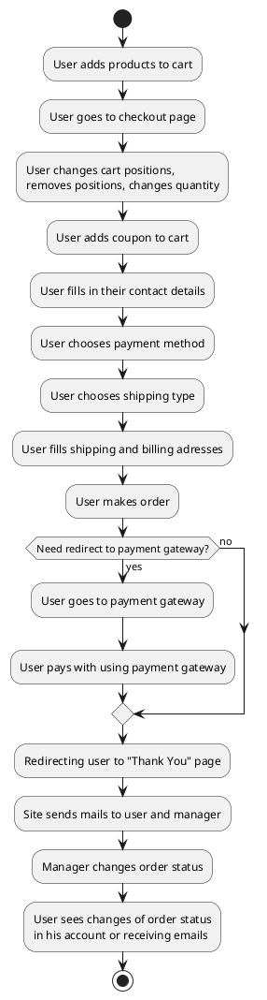
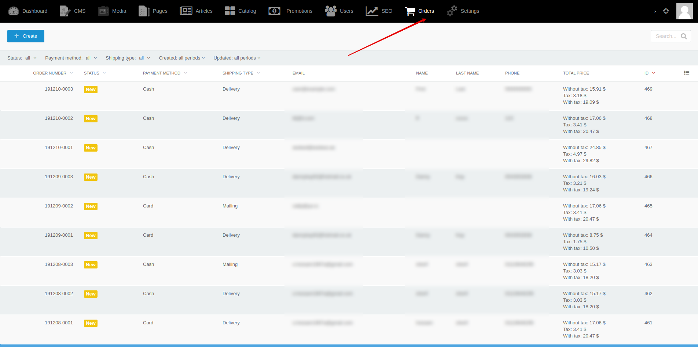
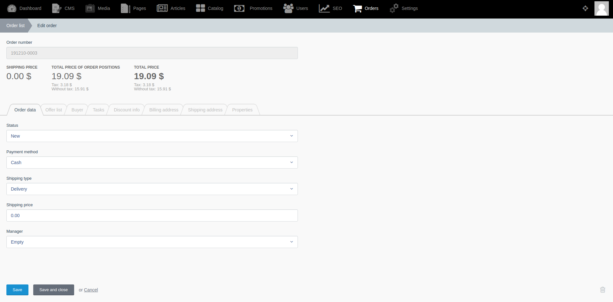
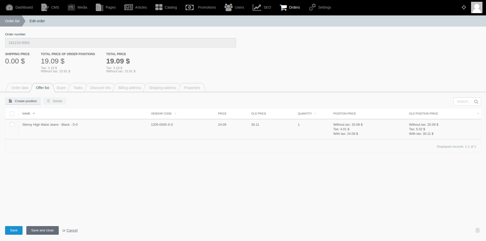
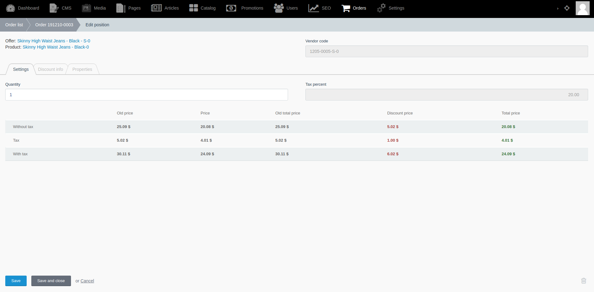

[Back to modules](modules/home.md)

Home
• [Model](modules/order/model/model.md)
• [Item](modules/order/item/item.md)
• [Collection](modules/order/collection/collection.md)
• [Components](modules/order/component/component.md)
• [Events](modules/order/event/event.md)
• [Examples](modules/order/examples/examples.md)
• [Extending](modules/order/extending/extending.md)

# Order {docsify-ignore-all}

!> **Attention!**  We recommend that you read [Architecture](architecture/architecture), [ElementItem class](architecture/item-class/item-class.md),
[ElementCollection class](architecture/collection-class/collection-class.md) sections for complete understanding of  project architecture.

> Module available with [Orders for Shopaholic](plugins/home#orders-for-shopaholic) plugin.

Order is one of main entities in your project.
Order has complex logic.
Before developing your project, you need to determine flow
through which user will go before purchase and how order will be changed according to status scheme after purchase.

For example, your flow might be like this:

## Backend

You can create and edit orders by going to **Backend -> Orders**

Home
• [Model](modules/order/model/model.md)
• [Item](modules/order/item/item.md)
• [Collection](modules/order/collection/collection.md)
• [Components](modules/order/component/component.md)
• [Events](modules/order/event/event.md)
• [Examples](modules/order/examples/examples.md)
• [Extending](modules/order/extending/extending.md)

[Back to modules](modules/home.md)
