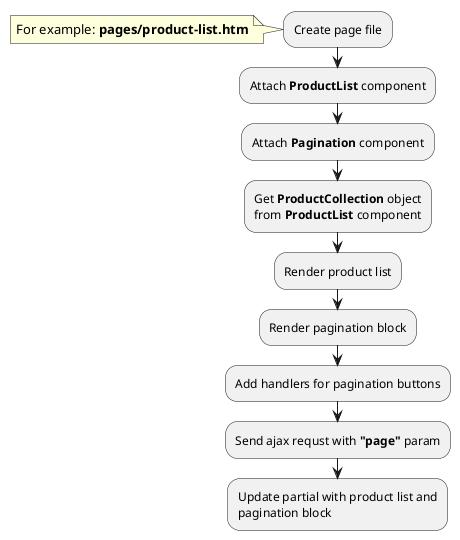
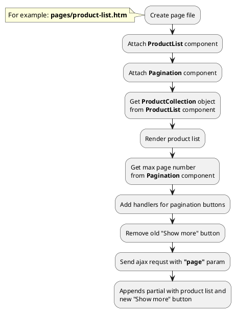




* [Example 1: Pagination block](#example-1-pagination-block)
* [Example 2: Show more button](#example-2-show-more-button)

## Example 1: Pagination block

### 1.1 Task

Create simple catalog page with pagination.

### 1.2 How can i do it?

> Example uses {{ component.link('pagination') }} and {{ get_component('product').link('product-list') }} components.

### 1.3 Source code

{{ get_module('product').example('pages/product-list-1.htm')|raw }}

{{ get_module('product').example('partials/product/catalog/catalog-1.htm')|raw }}

{{ get_module('product').example('partials/product/product-card/product-card-1.htm')|raw }}

{{ get_module('pagination').example('partials/pagination/pagination-1.htm')|raw }}

## Example 2: Show more button

### 2.1 Task

Create simple catalog page with "Show more" button.

### 2.2 How can i do it?

> Example uses {{ component.link('pagination') }} and {{ get_component('product').link('product-list') }} components.

### 2.3 Source code

{{ get_module('product').example('pages/product-list-1.htm')|raw }}

{{ get_module('product').example('partials/product/catalog/catalog-1.htm')|raw }}

{{ get_module('product').example('partials/product/product-card/product-card-1.htm')|raw }}

{{ get_module('pagination').example('partials/pagination/pagination-3.htm')|raw }}
