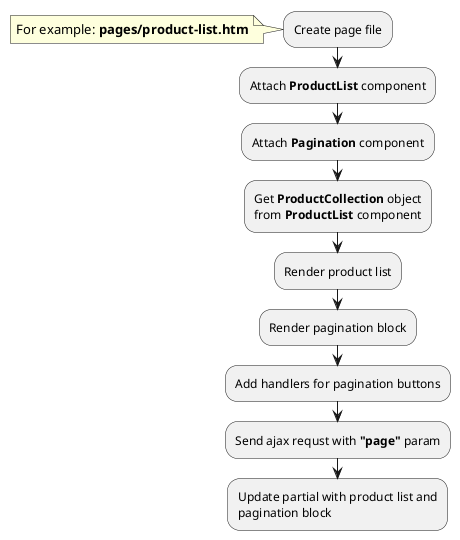

## Example {{ i }}: Pagination block

### {{ i }}.1 Task

Create simple catalog page with pagination.

### {{ i }}.2 How can i do it?

> Example uses {{ component.link('pagination') }} and {{ get_component('product').link('product-list') }} components.

### {{ i }}.3 Source code

{{ get_module('product').example('pages/product-list-1.htm')|raw }}

{{ get_module('product').example('partials/product/catalog/catalog-1.htm')|raw }}

{{ get_module('product').example('partials/product/product-card/product-card-1.htm')|raw }}

{{ get_module('pagination').example('partials/pagination/pagination-1.htm')|raw }}
