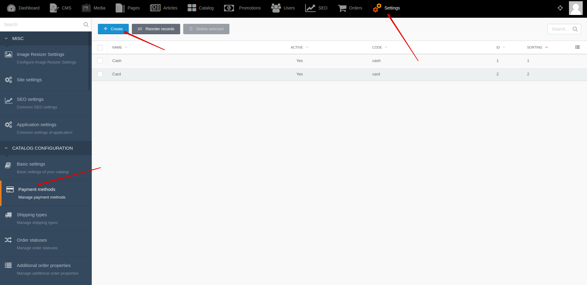

[Back to modules](modules/home.md)

Home
<!--
• [Model](modules/payment-method/model/model.md)
• [Item](modules/payment-method/item/item.md)
• [Collection](modules/payment-method/collection/collection.md)
• [Components](modules/payment-method/component/component.md)
• [Events](modules/payment-method/event/event.md)
• [Examples](modules/payment-method/examples/examples.md)
• [Extending](modules/payment-method/extending/extending.md)
-->

# Payment method {docsify-ignore-all}

!> **Attention!**  We recommend that you read [Architecture](architecture/architecture), [ElementItem class](architecture/item-class/item-class.md),
[ElementCollection class](architecture/collection-class/collection-class.md) sections for complete understanding of  project architecture.

> Module available with [Orders for Shopaholic](plugins/home#orders-for-shopaholic) plugin.

Payment method allows the user to choose their preferred payment method before creating an order.
The payment method can be different: cash, card, online payment.
The payment method may be linked with one of the payment gateways (For example: PayPal, Stripe, etc.).
Link of payment methods and a payment gateway will allow you to redirect the user to the online payment page, after creating the order.

## Backend

You can create and edit payment methods by going to **Backend -> Settings -> Payment methods**

You can change sorting of payment methods by going to **Backend -> Settings -> Payment methods -> Reorder records**

Home
<!--
• [Model](modules/payment-method/model/model.md)
• [Item](modules/payment-method/item/item.md)
• [Collection](modules/payment-method/collection/collection.md)
• [Components](modules/payment-method/component/component.md)
• [Events](modules/payment-method/event/event.md)
• [Examples](modules/payment-method/examples/examples.md)
• [Extending](modules/payment-method/extending/extending.md)
-->

[Back to modules](modules/home.md)
