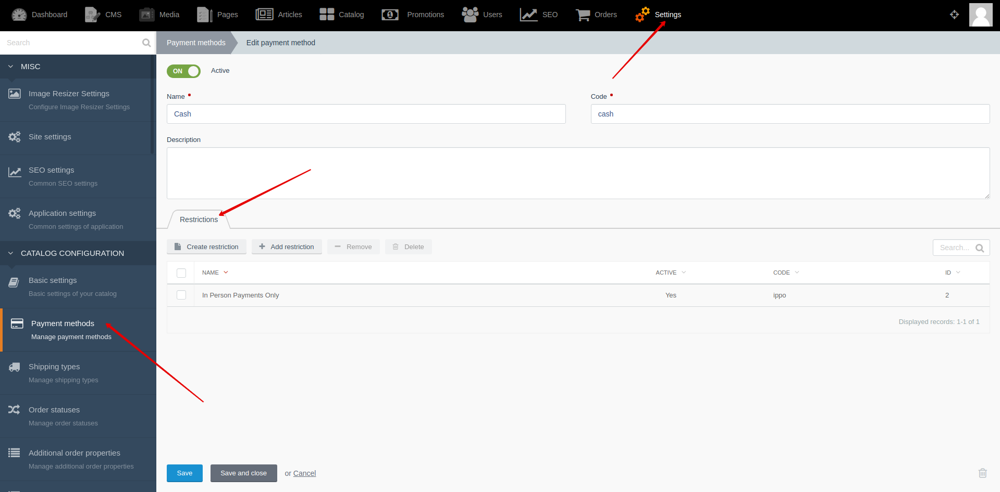




{{ parent() }}

Payment restrictions give you the opportunity to have different lists of payment methods.
For example, user may see different lists of payment methods for different regions or for different price ranges.

## Backend

You can create and edit payment restrictions by going to **Backend -> Settings -> Payment methods -> "Restriction" tab**


