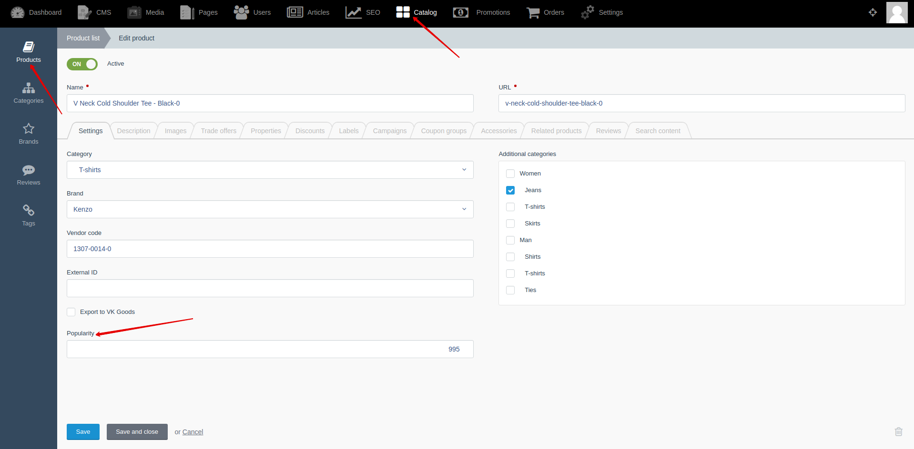




{{ parent() }}

"Popularity" module adds popularity to products.
Products with a higher popularity value will be higher than products with a lower popularity value.
You can change the value of the product’s popularity manually.

Product popularity can be increased automatically when costumer open product page, add the product to cart, and make an order.
You can specify count by which the product’s popularity will be increased.
You can configure increase of product popularity by going to **Backend -> Settings -> Basic settings -> "Popularity" tab**.


