## Example {{ i }}: Switch active price type

### {{ i }}.1 Task

Switch active price type with using PriceTypeHelper class.
Create simple product page and render price block.

### {{ i }}.2 How can i do it?

> Example uses {{ get_component('product').link('product-page') }} component.
Component method returns {{ get_item('product').link() }} class object.
All available fields and methods of **ProductItem** class you can find in {{ get_item('product').link('section') }}.

```plantuml
@startuml
:Switch active price type
with using PriceTypeHelper class;
note left
    Сode must be executed before the page is rendered
end note
:Create page file;
note left
    For example: **pages/product-page.htm**
end note
:Attach **ProductPage** component;
:Get **ProductItem** object
from **ProductPage** component;
:Get first **OfferItem** object
from **ProductItem** object;
:Render price block;
@enduml
```

### {{ i }}.3 Source code

{{ get_module('price-type').example('plugin/switch-price-type-1.php')|raw }}

{{ get_module('price-type').example('pages/product-page-1.htm')|raw }}

