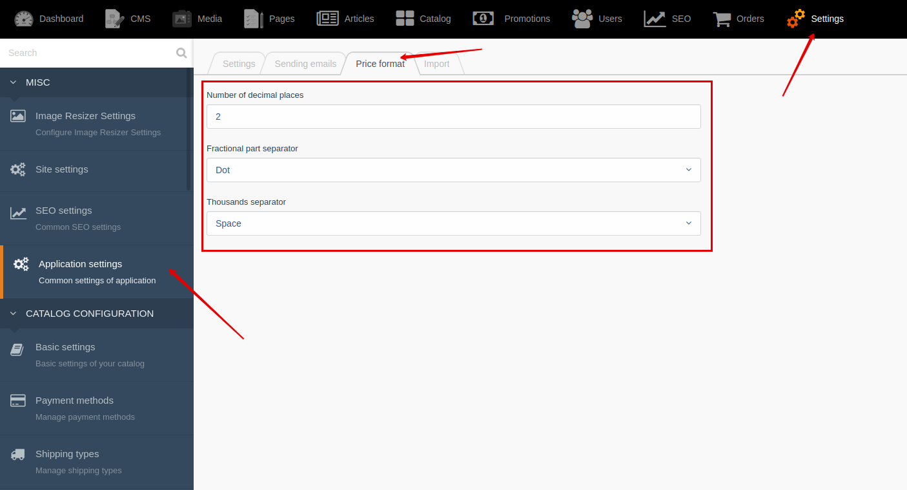
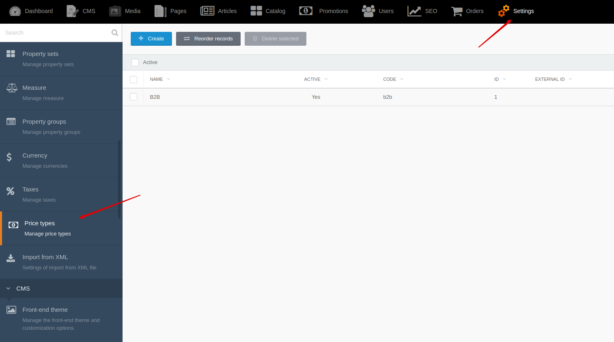
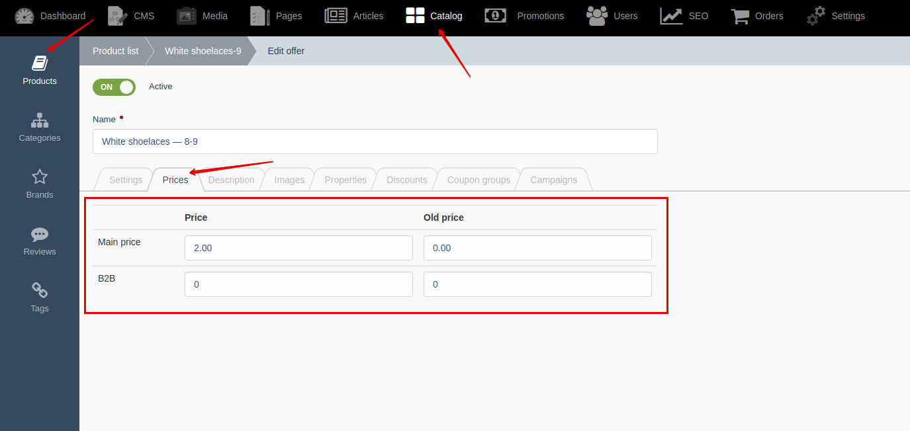

# Prices {docsify-ignore-all}

!> **Attention!**  We recommend that you read [Architecture](home.md#architecture), [ElementItem class](item-class/item-class.md),
[ElementCollection class](collection-class/collection-class.md) sections for complete understanding of  project architecture.

## Backend

!> **Attention!** All offer prices must be set in default currency.

!> **Attention!** You can set **price format** in Backend -> Settings -> Application settings -> "Price format" tab

You can create and edit price types by going to **Backend -> Settings -> Price types**

After creating price type you can fill prices in offers

