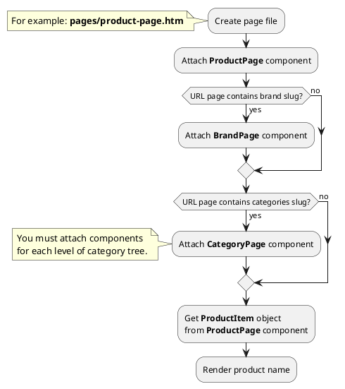
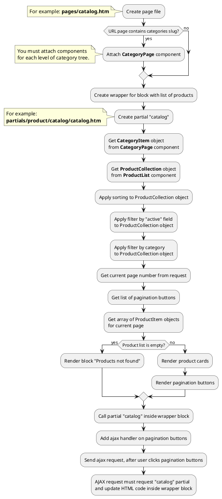
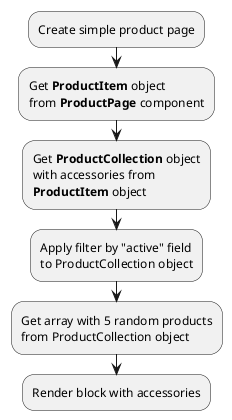
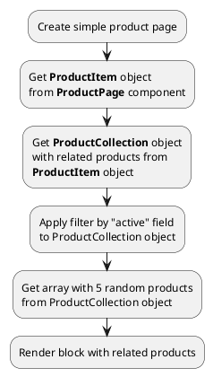
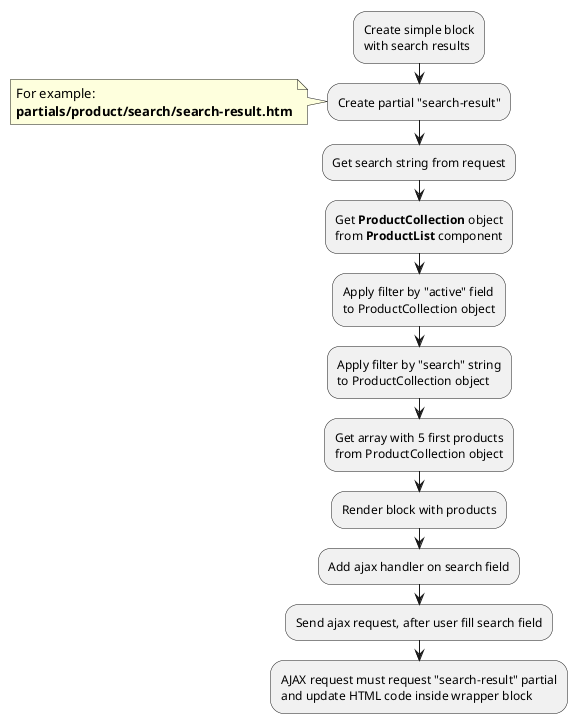
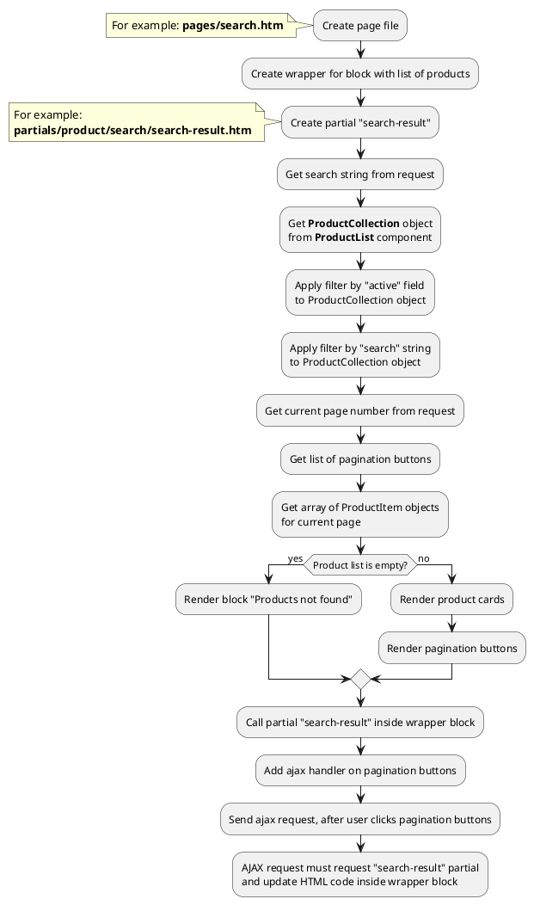




* [Example 1: Product page](#example-1-product-page)
* [Example 2: Product card](#example-2-product-card)
* [Example 3: Catalog page](#example-3-catalog-page)
* [Example 4: Accessories on product page](#example-4-accessories-on-product-page)
* [Example 5: Related products on product page](#example-5-related-products-on-product-page)
* [Example 6: Simple search results](#example-6-simple-search-results)
* [Example 7: Search page](#example-7-search-page)

## Example 1: Product page

### 1.1 Task
Create simple product page and render product name.

### 1.2 How can i do it?

> Example uses {{ get_component('product').link('product-page') }} component.
Component method returns {{ get_item('product').link() }} class object.
All available fields and methods of **ProductItem** class you can find in {{ get_item('product').link('section') }}.

### 1.3 Source code
<!-- tabs:start -->
#### ** Variant 1 **

Simple example of product page. Page URL does not contain category slug.

{{ get_module('product').example('pages/product-page-1.htm')|raw }}
#### ** Variant 2 **

Simple example of product page. Page URL contains category slug (two levels).

> CategoryPage components must be attached on page so that child categories are higher than parent categories.

{{ get_module('product').example('pages/product-page-2.htm')|raw }}
#### ** Variant 3 **

Simple example of product page. Page URL contains category (two levels) and brand slug.

> CategoryPage components must be attached on page so that child categories are higher than parent categories.

{{ get_module('product').example('pages/product-page-3.htm')|raw }}

#### ** Wildcard **

Catalog page with wildcard URL parameter.

{{ get_module('product').example('pages/product-page-4.htm')|raw }}
<!-- tabs:end -->

## Example 2: Product card

### 2.1 Task
Create simple product card and render product name, preview_image, preview_text fields.
Render link on product page.

> **"obProduct"** is object of {{ get_item('product').link() }} class.

### 2.2 Source code

Simple example of product card.

{{ get_module('product').example('partials/product/product-card/product-card-1.htm')|raw }}

## Example 3: Catalog page

### 3.1 Task
Create simple catalog page and render product list.
Product list must be sorted and filtered by category.
Product list must have pagination block.

### 3.2 How can i do it?

> Example uses {{ get_component('product').link('product-list') }} component.
Component method returns {{ get_collection('product').link() }} class object.
All available methods of **ProductCollection** class you can find in {{ get_collection('product').link('section') }}.

### 3.3 Source code

<!-- tabs:start -->

#### ** One level **

Simple example of catalog page (one level).

{{ get_module('product').example('pages/catalog-1.htm')|raw }}

{{ get_module('product').example('partials/product/catalog/catalog-2.htm')|raw }}

{{ get_module('product').example('partials/product/product-card/product-card-1.htm')|raw }}

{{ get_module('pagination').example('partials/pagination/pagination-1.htm')|raw }}

#### ** Two levels **

Simple example of catalog page (two levels).

> CategoryPage components must be attached on page so that child categories are higher than parent categories.

{{ get_module('product').example('pages/catalog-2.htm')|raw }}

{{ get_module('product').example('partials/product/catalog/catalog-2.htm')|raw }}

{{ get_module('product').example('partials/product/product-card/product-card-1.htm')|raw }}

{{ get_module('pagination').example('partials/pagination/pagination-1.htm')|raw }}

#### ** Wildcard **

Catalog page with wildcard URL parameter.

{{ get_module('product').example('pages/catalog-3.htm')|raw }}

{{ get_module('product').example('partials/product/catalog/catalog-2.htm')|raw }}

{{ get_module('product').example('partials/product/product-card/product-card-1.htm')|raw }}

{{ get_module('pagination').example('partials/pagination/pagination-1.htm')|raw }}

<!-- tabs:end -->

## Example 4: Accessories on product page

### 4.1 Task

Create simple product page and render block with 5 random accessories.
 
> Block with accessories can look like any block with product list.
Block can be simple (for example: slider with 5 random accessories).
Block can be complicated (contain searching, filtering, sorting, pagination).

### 4.2 How can i do it?

!> Accessories {{ 'accessories'|available_with|lcfirst }}

### 4.3 Source code

Simple example of product page.

{{ get_module('product').example('pages/product-page-5.htm')|raw }}

{{ get_module('product').example('partials/product/product-card/product-card-1.htm')|raw }}

## Example 5: Related products on product page

### 5.1 Task

Create simple product page and render block with 5 random related products.

> Block with related products can look like any block with product list.
Block can be simple (for example: slider with 5 random related products).
Block can be complicated (contain searching, filtering, sorting, pagination).

### 5.2 How can i do it?

!> Related products {{ 'related-products'|available_with|lcfirst }}

### 5.3 Source code

Simple example of product page.

{{ get_module('product').example('pages/product-page-6.htm')|raw }}

{{ get_module('product').example('partials/product/product-card/product-card-1.htm')|raw }}

## Example 6: Simple search results

### 6.1 Task

Create simple block with serch results and render 5 first products.

### 6.2 How can i do it?

!> Search method {{ ['search', 'sphinx']|available_with|lcfirst }}

> Example uses {{ get_component('product').link('product-list') }} component.
Component method returns {{ get_collection('product').link() }} class object.
All available methods of **ProductCollection** class you can find in {{ get_collection('product').link('section') }}.
Block can be complicated (contain filtering, pagination)

### 6.3 Source code

Simple example of block with search results.

{{ get_module('product').example('partials/product/search/search-result-1.htm')|raw }}

{{ get_module('product').example('partials/product/product-card/product-card-1.htm')|raw }}

## Example 7: Search page

### 7.1 Task

Create simple search page and render product list.
Product list must have pagination block.

### 7.2 How can i do it?

!> Search method {{ ['search', 'sphinx']|available_with|lcfirst }}

> Example uses {{ get_component('product').link('product-list') }} component.
Component method returns {{ get_collection('product').link() }} class object.
All available methods of **ProductCollection** class you can find in {{ get_collection('product').link('section') }}.
Block can be complicated (contain filtering, pagination)

### 7.3 Source code

{{ get_module('product').example('pages/search-1.htm')|raw }}

{{ get_module('product').example('partials/product/search/search-result-2.htm')|raw }}

{{ get_module('product').example('partials/product/product-card/product-card-1.htm')|raw }}

{{ get_module('pagination').example('partials/pagination/pagination-1.htm')|raw }}
