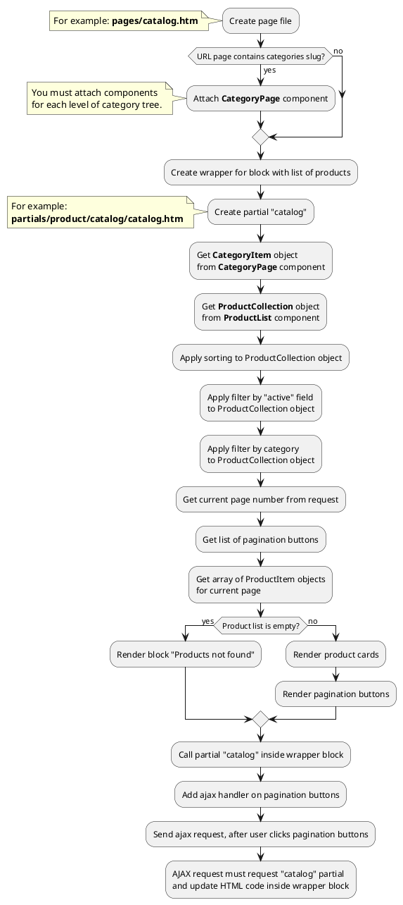

## Example {{ i }}: Catalog page

### {{ i }}.1 Task
Create simple catalog page and render product list.
Product list must be sorted and filtered by category.
Product list must have pagination block.

### {{ i }}.2 How can i do it?

> Example uses {{ get_component('product').link('product-list') }} component.
Component method returns {{ get_collection('product').link() }} class object.
All available methods of **ProductCollection** class you can find in {{ get_collection('product').link('section') }}.

### {{ i }}.3 Source code

<!-- tabs:start -->

#### ** One level **

Simple example of catalog page (one level).

{{ get_module('product').example('pages/catalog-1.htm')|raw }}

{{ get_module('product').example('partials/product/catalog/catalog-2.htm')|raw }}

{{ get_module('product').example('partials/product/product-card/product-card-1.htm')|raw }}

{{ get_module('pagination').example('partials/pagination/pagination-1.htm')|raw }}

#### ** Two levels **

Simple example of catalog page (two levels).

> CategoryPage components must be attached on page so that child categories are higher than parent categories.

{{ get_module('product').example('pages/catalog-2.htm')|raw }}

{{ get_module('product').example('partials/product/catalog/catalog-2.htm')|raw }}

{{ get_module('product').example('partials/product/product-card/product-card-1.htm')|raw }}

{{ get_module('pagination').example('partials/pagination/pagination-1.htm')|raw }}

#### ** Wildcard **

Catalog page with wildcard URL parameter.

{{ get_module('product').example('pages/catalog-3.htm')|raw }}

{{ get_module('product').example('partials/product/catalog/catalog-2.htm')|raw }}

{{ get_module('product').example('partials/product/product-card/product-card-1.htm')|raw }}

{{ get_module('pagination').example('partials/pagination/pagination-1.htm')|raw }}

<!-- tabs:end -->