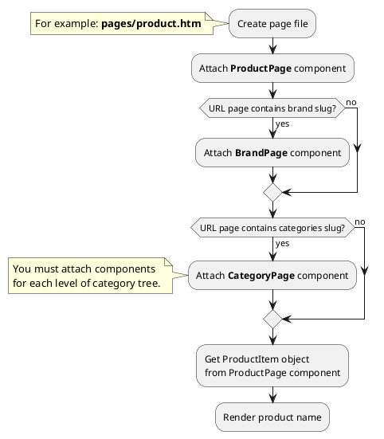
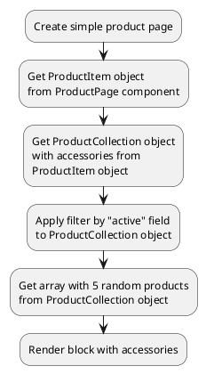
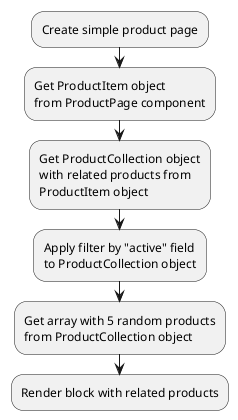
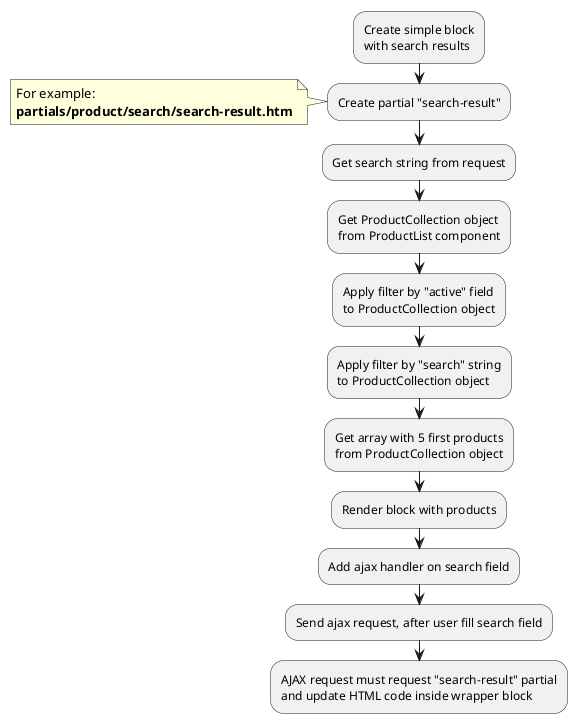
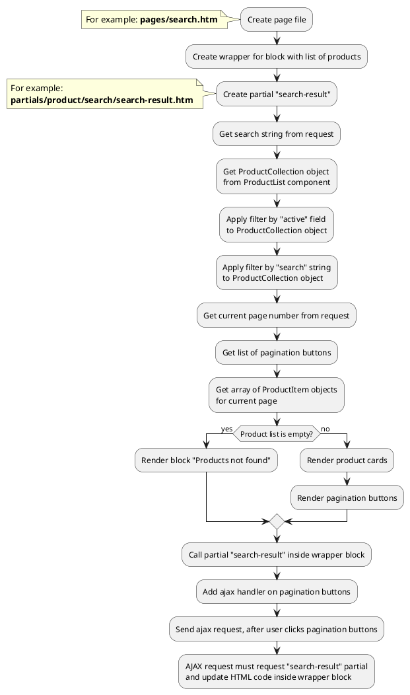

[Back to modules](modules/home.md)

[Home](modules/product/home.md)
• [Model](modules/product/model/model.md)
• [Item](modules/product/item/item.md)
• [Collection](modules/product/collection/collection.md)
• [Components](modules/product/component/component.md)
• [Events](modules/product/event/event.md)
• Examples
• [Extending](modules/product/extending/extending.md)

# Examples: Product {docsify-ignore-all}

!> **Attention!** We recommend that you read [Architecture](home.md#architecture), [ElementItem class](item-class/item-class.md),
[ElementCollection class](collection-class/collection-class.md) sections for complete understanding of  project architecture.

* [Example 1: Product page](#example-1-product-page)
* [Example 2: Product card](#example-2-product-card)
* [Example 3: Catalog page](#example-3-catalog-page)
* [Example 4: Accessories on product page](#example-4-accessories-on-product-page)
* [Example 5: Related products on product page](#example-5-related-products-on-product-page)
* [Example 6: Simple search results](#example-6-simple-search-results)
* [Example 7: Search page](#example-7-search-page)

## Example 1: Product page

### 1.1 Task
Create simple product page and render product name.

### 1.2 How can i do it?

> Example uses [ProductPage](modules/product/component/component.md#productpage) component.
Component method returns [ProductItem](modules/product/item/item.md#productitem) class object.
All available fields and methods of **ProductItem** class you can find in [section](modules/product/item/item.md#productitem)



### 1.3 Source code
<!-- tabs:start -->
#### ** Variant 1 **

Simple example of product page. Page URL does not contain category slug.

File: **pages/product.htm**
```twig
title = "Product page"
url = "/product/:slug"
layout = "main"
is_hidden = 0

[ProductPage]
slug = "{{ :slug }}"
slug_required = 1
==

{# Get product item #}


<div data-id="{{ obProduct.id }}" itemscope itemtype="http://schema.org/Product">
    <h1 itemprop="name">{{ obProduct.name }}</h1>
</div>
```
#### ** Variant 2 **

Simple example of product page. Page URL contains category slug.

> This example is suitable for **2-level** catalog.

File: **pages/product.htm**
```twig
title = "Product page"
url = "/catalog/:main_category/:category/:slug"
layout = "main"
is_hidden = 0

[ProductPage]
slug = "{{ :slug }}"
slug_required = 1
smart_url_check = 1

[CategoryPage]
slug = "{{ :category }}"
slug_required = 1

[CategoryPage ParentCategoryPage]
slug = "{{ :main_category }}"
slug_required = 1
==

{# Get product item #}


<div data-id="{{ obProduct.id }}" itemscope itemtype="http://schema.org/Product">
    <h1 itemprop="name">{{ obProduct.name }}</h1>
</div>
```

#### ** Variant 3 **

Simple example of product page. Page URL contains category and brand slug.

> This example is suitable for **2-level** catalog.

File: **pages/product.htm**
```twig
title = "Product page"
url = "/catalog/:main_category/:category/:brand/:slug"
layout = "main"
is_hidden = 0

[ProductPage]
slug = "{{ :slug }}"
slug_required = 1
smart_url_check = 1

[BrandPage]
slug = "{{ :brand }}"
slug_required = 1

[CategoryPage]
slug = "{{ :category }}"
slug_required = 1

[CategoryPage ParentCategoryPage]
slug = "{{ :main_category }}"
slug_required = 1
==

{# Get product item #}


<div data-id="{{ obProduct.id }}" itemscope itemtype="http://schema.org/Product">
    <h1 itemprop="name">{{ obProduct.name }}</h1>
</div>
```
<!-- tabs:end -->

## Example 2: Product card

### 2.1 Task
Create simple product card and render product name, preview_image, preview_text fields.
Render link on product page.

> **"obProduct"** is object of [ProductItem](modules/product/item/item.md#productitem) class.

### 2.2 Source code

Simple example of product card.

File: **partials/product/product-card/product-card.htm**
```twig
<a href="{{ obProduct.getPageUrl() }}">
    <div itemscope itemtype="http://schema.org/Product">
        
            
        
        <h3 itemprop="name">{{ obProduct.name }}</h3>
        
            <div itemprop="description">
                {{ obProduct.preview_text }}
            </div>
        
    </div>
</a>
```

## Example 3: Catalog page

### 3.1 Task
Create simple catalog page and render product list.
Product list must be sorted and filtered by category.
Product list must have pagination block.

### 3.2 How can i do it?

> Example uses [ProductList](modules/product/component/component.md#productlist) component.
Component method returns [ProductCollection](modules/product/collection/collection.md#productcollection) class object.
All available methods of **ProductCollection** class you can find in [section](modules/product/collection/collection.md#productcollection)


### 3.3 Source code

File: **pages/catalog.htm**
```twig
title = "Catalog"
url = "/catalog/:main_category/:category"
layout = "main"
is_hidden = 0

[CategoryPage]
slug = "{{ :category }}"
slug_required = 1
smart_url_check = 1

[CategoryPage ParentCategoryPage]
slug = "{{ :main_category }}"
slug_required = 1

[ProductList]
sorting = "popularity|desc"

[Pagination]
count_per_page = 15
pagination_limit = 5
active_class = ""
button_list = "first,first-more,main,last-more,last"
first_button_name = "First"
first_button_limit = 3
first_button_number = 1
first-more_button_name = "..."
first-more_button_limit = 4
prev_button_name = "Prev"
prev_button_limit = 1
prev-more_button_name = "..."
prev-more_button_limit = 1
next-more_button_name = "..."
next-more_button_limit = 1
next_button_name = "Next"
next_button_limit = 1
last-more_button_name = "..."
last-more_button_limit = 4
last_button_name = "Last"
last_button_limit = 3
last_button_number = 1
==
<div class="catalog-wrapper">
    
</div>
```

File: **partials/product/catalog/catalog.htm**
```twig


{# Get product collection #}


{# Get array with pagination buttons #}



{# Apply pagination to product collection and get array with product items #}



    {# Render product list #}
    <ul>
        
            <li></li>
        
    </ul>
    
    {# Render pagination buttons #}
    
        
            <a href="{{ obCategory.getPageUrl() }}?page={{ arPagination.value }}" class="{{ arPagination.class }}">
                {{ arPagination.name }}
            </a>
        
    

    <div>
        Products not found
    </div>

```

## Example 4: Accessories on product page

### 4.1 Task

Create simple product page and render block with 5 random accessories.
 
> Block with accessories can look like any block with product list.
Block can be simple (for example: slider with 5 random accessories).
Block can be complicated (contain searching, filtering, sorting, pagination).

### 4.2 How can i do it?

!> Accessories available with [Accessories for Shopaholic](plugins/home.md#accessories-for-shopaholic) plugin



### 4.3 Source code

Simple example of product page.

File: **pages/product.htm**
```twig
title = "Product page"
url = "/product/:slug"
layout = "main"
is_hidden = 0

[ProductPage]
slug = "{{ :slug }}"
slug_required = 1
==

{# Get product item #}


<div data-id="{{ obProduct.id }}" itemscope itemtype="http://schema.org/Product">
    <h1 itemprop="name">{{ obProduct.name }}</h1>
</div>

{# Get accessories + apply filder by "active" field #}



<div>
    <span>Accessories</span>
    {# Render product list #}
    <ul>
        
            <li></li>
        
    </ul>
</div>

```

## Example 5: Related products on product page

### 5.1 Task

Create simple product page and render block with 5 random related products.

> Block with related products can look like any block with product list.
Block can be simple (for example: slider with 5 random related products).
Block can be complicated (contain searching, filtering, sorting, pagination).

### 5.2 How can i do it?

!> Related products available with [Related products for Shopaholic](plugins/home.md#related-products-for-shopaholic) plugin



### 5.3 Source code

Simple example of product page.

File: **pages/product.htm**
```twig
title = "Product page"
url = "/product/:slug"
layout = "main"
is_hidden = 0

[ProductPage]
slug = "{{ :slug }}"
slug_required = 1
==

{# Get product item #}


<div data-id="{{ obProduct.id }}" itemscope itemtype="http://schema.org/Product">
    <h1 itemprop="name">{{ obProduct.name }}</h1>
</div>

{# Get related products + apply filder by "active" field #}



<div>
    <span>Related products</span>
    {# Render product list #}
    <ul>
        
            <li></li>
        
    </ul>
</div>

```

## Example 6: Simple search results

### 6.1 Task

Create simple block with serch results and render 5 first products.

### 6.2 How can i do it?

!> Search method available with [Search for Shopaholic](plugins/home.md#search-for-shopaholic) plugin

> Example uses [ProductList](modules/product/component/component.md#productlist) component.
Component method returns [ProductCollection](modules/product/collection/collection.md#productcollection) class object.
All available methods of **ProductCollection** class you can find in [section](modules/product/collection/collection.md#productcollection).
Block can be complicated (contain filtering, pagination)



### 6.3 Source code

Simple example of block with search results.

File: **partials/product/search/search-result.htm**
```twig
[ProductList]
sorting = "popularity|desc"
==
{# Get search string #}


{# Get product collection #}


{# Get first 5 products #}



    {# Render product list #}
    <ul>
        
            <li></li>
        
    </ul>

    <div>
        Products not found
    </div>

```

## Example 7: Search page

### 7.1 Task
Create simple search page and render product list.
Product list must have pagination block.

### 7.2 How can i do it?

!> Search method available with [Search for Shopaholic](plugins/home.md#search-for-shopaholic) plugin

> Example uses [ProductList](modules/product/component/component.md#productlist) component.
Component method returns [ProductCollection](modules/product/collection/collection.md#productcollection) class object.
All available methods of **ProductCollection** class you can find in [section](modules/product/collection/collection.md#productcollection).
Block can be complicated (contain filtering, pagination)



### 7.3 Source code

File: **pages/search.htm**
```twig
title = "Search"
url = "/search"
layout = "main"
is_hidden = 0

[ProductList]
sorting = "popularity|desc"

[Pagination]
count_per_page = 15
pagination_limit = 5
active_class = ""
button_list = "first,first-more,main,last-more,last"
first_button_name = "First"
first_button_limit = 3
first_button_number = 1
first-more_button_name = "..."
first-more_button_limit = 4
prev_button_name = "Prev"
prev_button_limit = 1
prev-more_button_name = "..."
prev-more_button_limit = 1
next-more_button_name = "..."
next-more_button_limit = 1
next_button_name = "Next"
next_button_limit = 1
last-more_button_name = "..."
last-more_button_limit = 4
last_button_name = "Last"
last_button_limit = 3
last_button_number = 1
==
<div class="search-wrapper">
    
</div>
```

File: **partials/product/search/search-result.htm**
```twig
{# Get search string #}


{# Get product collection #}


{# Get array with pagination buttons #}



{# Apply pagination to product collection and get array with product items #}



    {# Render product list #}
    <ul>
        
            <li></li>
        
    </ul>
    
    {# Render pagination buttons #}
    
        
            <a href="{{ obCategory.getPageUrl() }}?page={{ arPagination.value }}" class="{{ arPagination.class }}">
                {{ arPagination.name }}
            </a>
        
    

    <div>
        Products not found
    </div>

```

[Home](modules/product/home.md)
• [Model](modules/product/model/model.md)
• [Item](modules/product/item/item.md)
• [Collection](modules/product/collection/collection.md)
• [Components](modules/product/component/component.md)
• [Events](modules/product/event/event.md)
• Examples
• [Extending](modules/product/extending/extending.md)

[Back to modules](modules/home.md)
