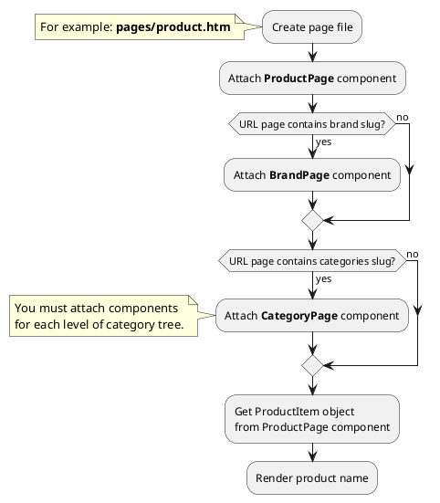
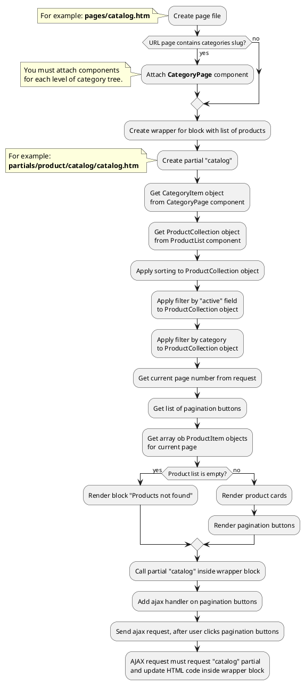

# Examples: Product

!> **Attention!** We recommend that you read [Architecture](home.md#architecture), [ElementItem class](item-class/item-class.md),
[ElementCollection class](collection-class/collection-class.md) sections for complete understanding of  project architecture.

## Example 1: Product page

### Task
Create simple product page and render product name.

### How can i do it?



### Source code
<!-- tabs:start -->
#### ** Variant 1 **

Simple example of product page. Page URL does not contain category slug.

File: **pages/product.htm**
```twig
title = "Product page"
url = "/product/:slug"
layout = "main"
is_hidden = 0

[ProductPage]
slug = "{{ :slug }}"
slug_required = 1
==

{# Get product item #}


<div data-id="{{ obProduct.id }}" itemscope itemtype="http://schema.org/Product">
    <h1 itemprop="name">{{ obProduct.name }}</h1>
</div>
```
#### ** Variant 2 **

Simple example of product page. Page URL contains category slug.

> This example is suitable for **2-level** catalog.

File: **pages/product.htm**
```twig
title = "Product page"
url = "/catalog/:main_category/:category/:slug"
layout = "main"
is_hidden = 0

[ProductPage]
slug = "{{ :slug }}"
slug_required = 1
smart_url_check = 1

[CategoryPage]
slug = "{{ :category }}"
slug_required = 1

[CategoryPage ParentCategoryPage]
slug = "{{ :main_category }}"
slug_required = 1
==

{# Get product item #}


<div data-id="{{ obProduct.id }}" itemscope itemtype="http://schema.org/Product">
    <h1 itemprop="name">{{ obProduct.name }}</h1>
</div>
```

#### ** Variant 3 **

Simple example of product page. Page URL contains category and brand slug.

> This example is suitable for **2-level** catalog.

File: **pages/product.htm**
```twig
title = "Product page"
url = "/catalog/:main_category/:category/:brand/:slug"
layout = "main"
is_hidden = 0

[ProductPage]
slug = "{{ :slug }}"
slug_required = 1
smart_url_check = 1

[BrandPage]
slug = "{{ :brand }}"
slug_required = 1

[CategoryPage]
slug = "{{ :category }}"
slug_required = 1

[CategoryPage ParentCategoryPage]
slug = "{{ :main_category }}"
slug_required = 1
==

{# Get product item #}


<div data-id="{{ obProduct.id }}" itemscope itemtype="http://schema.org/Product">
    <h1 itemprop="name">{{ obProduct.name }}</h1>
</div>
```
<!-- tabs:end -->

## Example 2: Product card


### Task
Create simple product card and render product name, preview_image, preview_text fields.
Render link on product page.

### Source code
Simple example of product card.

File: **partials/product/product-card/product-card.htm**
```twig
<a href="{{ obProduct.getPageUrl() }}">
    <div itemscope itemtype="http://schema.org/Product">
        
            
        
        <h3 itemprop="name">{{ obProduct.name }}</h3>
        
            <div itemprop="description">
                {{ obProduct.preview_text }}
            </div>
        
    </div>
</a>
```

## Example 3: Catalog page

### Task
Create simple catalog page and render product list.
Product list must be sorted and filtered by category.
Product list must have pagination block.

### How can i do it?



### Source code
<!-- tabs:start -->

#### ** Variant 1 **

File: **pages/catalog.htm**
```twig
title = "Catalog"
url = "/catalog/:main_category/:category"
layout = "main"
is_hidden = 0

[CategoryPage]
slug = "{{ :category }}"
slug_required = 1
smart_url_check = 1

[CategoryPage ParentCategoryPage]
slug = "{{ :main_category }}"
slug_required = 1

[ProductList]
sorting = "popularity|desc"

[Pagination]
count_per_page = 15
pagination_limit = 5
active_class = ""
button_list = "first,first-more,main,last-more,last"
first_button_name = "First"
first_button_limit = 3
first_button_number = 1
first-more_button_name = "..."
first-more_button_limit = 4
prev_button_name = "Prev"
prev_button_limit = 1
prev-more_button_name = "..."
prev-more_button_limit = 1
next-more_button_name = "..."
next-more_button_limit = 1
next_button_name = "Next"
next_button_limit = 1
last-more_button_name = "..."
last-more_button_limit = 4
last_button_name = "Last"
last_button_limit = 3
last_button_number = 1
==
<div class="catalog-wrapper">
    
</div>
```

File: **partials/product/catalog/catalog.htm**
```twig


{# Get product collection #}


{# Get array with pagination buttons #}



{# Apply pagination to product collection and get array with product items #}



    {# Render product list #}
    <ul>
        
            <li></li>
        
    </ul>
    
    {# Render pagination buttons #}
    
        
            <a href="{{ obCategory.getPageUrl() }}?page={{ arPagination.value }}" class="{{ arPagination.class }}">
                {{ arPagination.name }}
            </a>
        
    

    <div>
        Products not found
    </div>

```
<!-- tabs:end -->