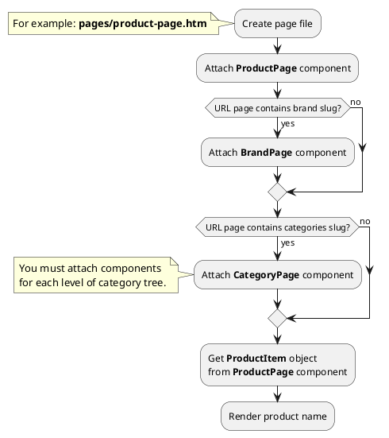

## Example {{ i }}: Product page

### {{ i }}.1 Task
Create simple product page and render product name.

### {{ i }}.2 How can i do it?

> Example uses {{ get_component('product').link('product-page') }} component.
Component method returns {{ get_item('product').link() }} class object.
All available fields and methods of **ProductItem** class you can find in {{ get_item('product').link('section') }}.

### {{ i }}.3 Source code
<!-- tabs:start -->
#### ** Variant 1 **

Simple example of product page. Page URL does not contain category slug.

{{ get_module('product').example('pages/product-page-1.htm')|raw }}
#### ** Variant 2 **

Simple example of product page. Page URL contains category slug (two levels).

> CategoryPage components must be attached on page so that child categories are higher than parent categories.

{{ get_module('product').example('pages/product-page-2.htm')|raw }}
#### ** Variant 3 **

Simple example of product page. Page URL contains category (two levels) and brand slug.

> CategoryPage components must be attached on page so that child categories are higher than parent categories.

{{ get_module('product').example('pages/product-page-3.htm')|raw }}

#### ** Wildcard **

Catalog page with wildcard URL parameter.

{{ get_module('product').example('pages/product-page-4.htm')|raw }}
<!-- tabs:end -->