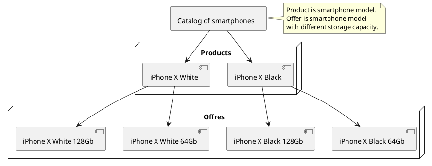
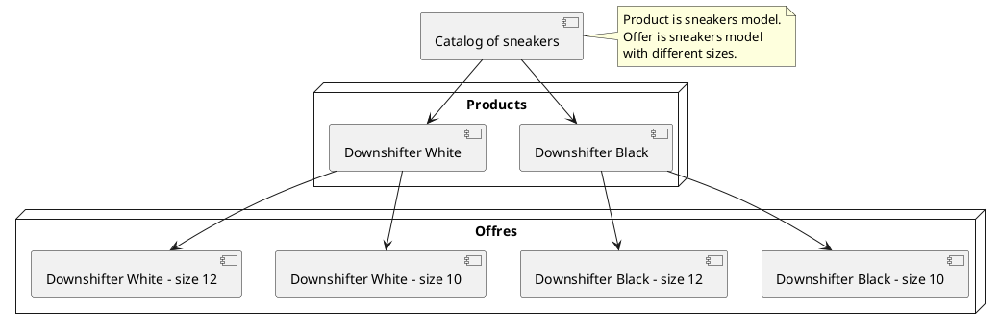
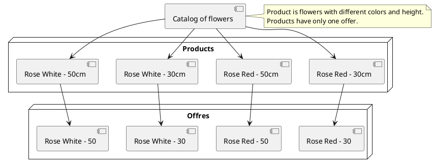




{{ parent() }}

## Introduction

Product is main unit of your catalog. For different projects, products may have different view.

!> **Attention!**  Designing catalog structure is very important stage before development of our project.
It is very important at this stage to determine what will be product and what will be offer in your catalog.
You can find more information in [section](catalog-structure/catalog-structure.md).

## Backend

You can create and edit products by going to **Backend -> Catalog -> Products**

## Active products

Often projects require you to hide products that do not have active offers.
You can enable additional check when you get list of active products.
If this setting is enabled, list of active products will contain only those products that have active offers.
Go to **Backend -> Settings -> Basic Settings**

## Import

You can import products from XML and CSV files.
You can use [events](modules/product/event/event#event-list-product), that allows you to extend import data.
 
> You can learn more about importing from [XML](import/import-from-xml/home.md#import-from-xml) and [CSV](import/import-from-csv/home.md#import-from-csv) files in [section](import/import-from-xml/home.md#import-from-xml).

#### Import from CSV

You can hide import buttons in "Basic settings".
Go to **Backend -> Settings -> Basic settings -> "Import" tab**

#### Import from XML

For big catalog, you can use queues to reduce server load during import.
You can enable queues in **"Application settings"**.
Go to **Backend -> Settings -> Application settings -> "Import" tab**

You can hide import buttons in "Basic settings".
Go to **Backend -> Settings -> Basic settings -> "Import" tab**


