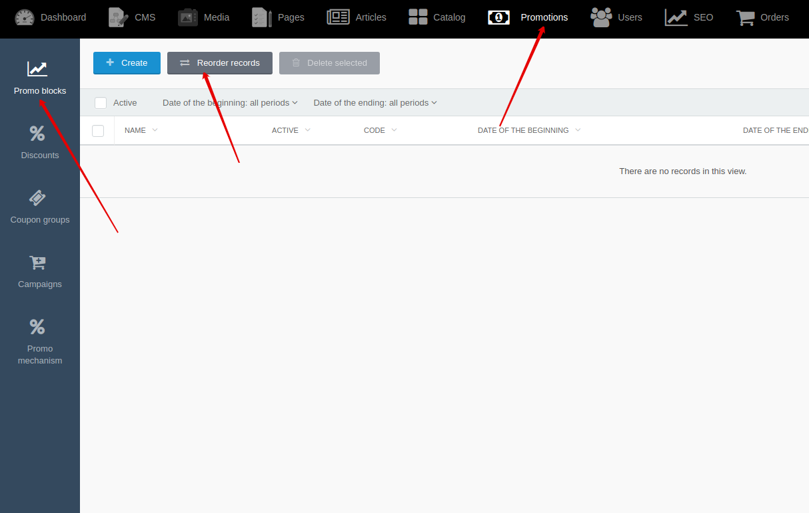

[Back to modules](modules/home.md)

[Home](modules/promo-block/home.md)
• [Model](modules/promo-block/model/model.md)
• [Item](modules/promo-block/item/item.md)
• Collection
• [Components](modules/promo-block/component/component.md)
• [Events](modules/promo-block/event/event.md)
• [Examples](modules/promo-block/examples/examples.md)
• [Extending](modules/promo-block/extending/extending.md)

# PromoBlockCollection {docsify-ignore-all}

!> **Attention!**  We recommend that you read [Architecture](architecture/architecture), [ElementItem class](architecture/item-class/item-class.md),
[ElementCollection class](architecture/collection-class/collection-class.md) sections for complete understanding of  project architecture.

!> **Attention!** **BrandCollection** extends [ElementCollection class](architecture/collection-class/collection-class.md).
All available methods of ElementCollection class you can find in [section](architecture/collection-class/collection-class.md#method-list) 

## Method list

* [active](#active)
* [hidden](#hidden)
* [notHidden](#nothidden)
* [sort](#sortssorting)

### active()

Method applies filter to field "active" = true  for elements of collection.

### hidden()

Method applies filter to field "hidden" = true  for elements of collection.

### notHidden()

Method applies filter to field "hidden" = false  for elements of collection.

### sort($sSorting)

Method sorts elements of collection by $sSorting value.
Available sorting value:
  * 'default' - default value, sorting by sort_order field value
  * 'date_begin|asc'
  * 'date_begin|desc'
  * 'date_end|asc'
  * 'date_end|desc'
```php
$obList = PromoBlockCollection::make([1,2,10,15])->sort('date_begin|desc');
```

You can change sorting of promo blocks by going to **Backend -> Promotions -> Promo blocks -> Reorder records**



[Home](modules/promo-block/home.md)
• [Model](modules/promo-block/model/model.md)
• [Item](modules/promo-block/item/item.md)
• Collection
• [Components](modules/promo-block/component/component.md)
• [Events](modules/promo-block/event/event.md)
• [Examples](modules/promo-block/examples/examples.md)
• [Extending](modules/promo-block/extending/extending.md)

[Back to modules](modules/home.md)
