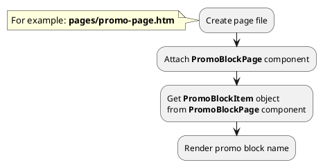
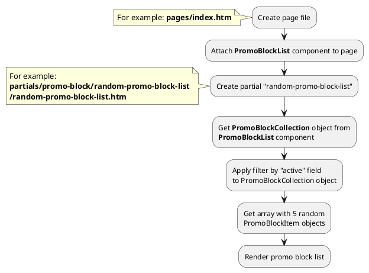
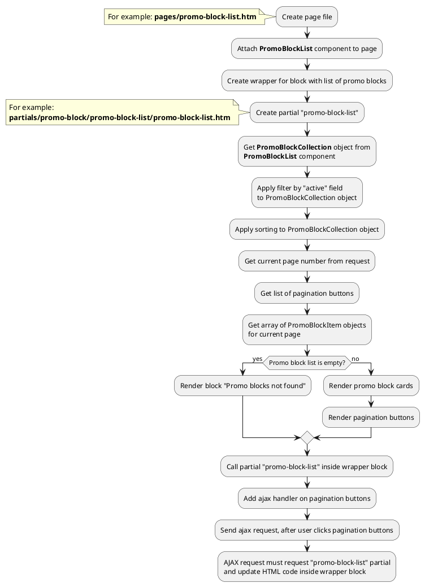




* [Example 1: Promo block page](#example-1-promo-block-page)
* [Example 2: Promo block card](#example-2-promo-block-card)
* [Example 3: Random promo block list](#example-3-random-promo-block-list)
* [Example 4: Promo block list with pagination](#example-4-promo-block-list-with-pagination)

## Example 1: Promo block page

### 1.1 Task

Create simple promo block page and render promo block name.

### 1.2 How can i do it?

> Example uses {{ component.link('promo-block-page') }} component.
Component method returns {{ item.link() }} class object.
All available fields and methods of **PromoBlockItem** class you can find in {{ item.link('section') }}.

### 1.3 Source code

{{ get_module('promo-block').example('pages/promo-page-1.htm')|raw }}

## Example 2: Promo block card

### 2.1 Task

Create simple promo block card and render promo block name, preview_image, preview_text fields.
Render link on promo block page.

> **"obPromoBlock"** is object of {{ item.link() }} class.

### 2.2 Source code

Simple example of promoblock card.

{{ get_module('promo-block').example('partials/promo-block/promo-block-card/promo-block-card-1.htm')|raw }}

## Example 3: Random promo block list

### 3.1 Task

Create simple block with random 5 promo block list on index page.

### 3.2 How can i do it?

> Example uses {{ component.link('promo-block-list') }} component.
Component method returns {{ collection.link() }} class object.
All available methods of **PromoBlockCollection** class you can find in {{ collection.link('section') }}.

### 3.3 Source code

{{ get_module('promo-block').example('pages/index-1.htm')|raw }}

{{ get_module('promo-block').example('partials/promo-block/random-promo-block-list/random-promo-block-list-1.htm')|raw }}

{{ get_module('promo-block').example('partials/promo-block/promo-block-card/promo-block-card-1.htm')|raw }}

## Example 4: Promo block list with pagination

### 4.1 Task

Create simple page with promo block list.
Promo block list must have pagination block.

### 4.2 How can i do it?

> Example uses {{ component.link('promo-block-list') }} component.
Component method returns {{ collection.link() }} class object.
All available methods of **PromoBlockCollection** class you can find in {{ collection.link('section') }}.

> You can find more information about **Pagination** component {{ get_module('pagination').link('here') }} 

### 4.3 Source code

{{ get_module('promo-block').example('pages/promo-block-list-1.htm')|raw }}

{{ get_module('promo-block').example('partials/promo-block/promo-block-list/promo-block-list-1.htm')|raw }}

{{ get_module('promo-block').example('partials/promo-block/promo-block-card/promo-block-card-1.htm')|raw }}

{{ get_module('pagination').example('partials/pagination/pagination-1.htm')|raw }}
