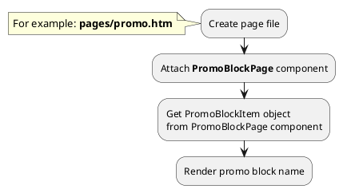
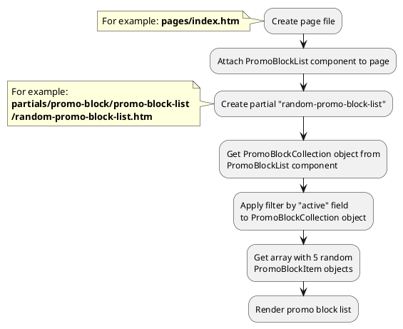
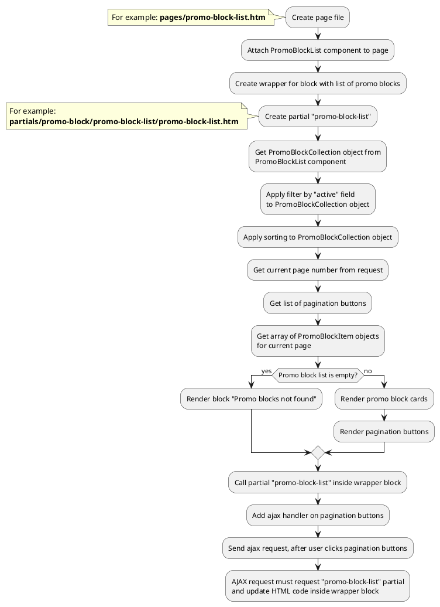

[Back to modules](modules/home.md)

[Home](modules/promo-block/home.md)
• [Model](modules/promo-block/model/model.md)
• [Item](modules/promo-block/item/item.md)
• [Collection](modules/promo-block/collection/collection.md)
• [Components](modules/promo-block/component/component.md)
• [Events](modules/promo-block/event/event.md)
• Examples
• [Extending](modules/promo-block/extending/extending.md)

# Examples: Promo block {docsify-ignore-all}

!> **Attention!** We recommend that you read [Architecture](architecture/architecture), [ElementItem class](architecture/item-class/item-class.md),
[ElementCollection class](architecture/collection-class/collection-class.md) sections for complete understanding of  project architecture.

* [Example 1: Promo block page](#example-1-promo-block-page)
* [Example 2: Promo block card](#example-2-promo-block-card)
* [Example 3: Random promo block list](#example-3-random-promo-block-list)
* [Example 4: Promo block list with pagination](#example-4-promo-block-list-with-pagination)

## Example 1: Promo block page

### 1.1 Task

Create simple promo block page and render promo block name.

### 1.2 How can i do it?

> Example uses [PromoBlockPage](modules/promo-block/component/component.md#promoblockpage) component.
Component method returns [PromoBlockItem](modules/promo-block/item/item.md#promoblockitem) class object.
All available fields and methods of **PromoBlockItem** class you can find in [section](modules/promo-block/item/item.md#promoblockitem)



### 1.3 Source code

File: **pages/promo.htm**
```twig
title = "Promo block page"
url = "/promo/:slug"
layout = "main"
is_hidden = 0

[PromoBlockPage]
slug = "{{ :slug }}"
slug_required = 1
==

{# Get promo block item #}


<div data-id="{{ obPromoBlock.id }}">
    <h1 itemprop="name">{{ obPromoBlock.name }}</h1>
</div>
```

## Example 2: Promo block card

### 2.1 Task

Create simple promo block card and render promo block name, preview_image, preview_text fields.
Render link on promo block page.

> **"obPromoBlock"** is object of [PromoBlockItem](modules/promo-block/item/item.md#promoblockitem) class.

### 2.2 Source code

Simple example of promoblock card.

File: **partials/promo-block/promo-block-card/promo-block-card.htm**
```twig
<a href="{{ obPromoBlock.getPageUrl('promo-block') }}">
    <div>
        
            
        
        <h3 itemprop="name">{{ obPromoBlock.name }}</h3>
        
            <div itemprop="description">
                {{ obPromoBlock.preview_text }}
            </div>
        
    </div>
</a>
```

## Example 3: Random promo block list

### 3.1 Task

Create simple block with random 5 promo block list on index page.

### 3.2 How can i do it?

> Example uses [PromoBlockList](modules/promo-block/component/component.md#promoblocklist) component.
Component method returns [PromoBlockCollection](modules/promo-block/collection/collection.md#promoblockcollection) class object.
All available methods of **PromoBlockCollection** class you can find in [section](modules/promo-block/collection/collection.md#promoblockcollection)



### 3.3 Source code

File: **pages/index.htm**
```twig
title = "Index"
url = "/"
layout = "main"
is_hidden = 0

[PromoBlockList]
==
<div class="promo-block-wrapper">
    
</div>
```

File: **partials/promo-block/promo-block-list/random-promo-block-list.htm**
```twig
{# Get promo block collection #}

{# Get array with random promo blocks #}



    {# Render promo block list #}
    <ul>
        
            <li></li>
        
    </ul>

```

## Example 4: Promo block list with pagination

### 4.1 Task

Create simple page with promo block list.
Promo block list must have pagination block.

### 4.2 How can i do it?

> Example uses [PromoBlockList](modules/promo-block/component/component.md#promoblocklist) component.
Component method returns [PromoBlockCollection](modules/promo-block/collection/collection.md#promoblockcollection) class object.
All available methods of **PromoBlockCollection** class you can find in [section](modules/promo-block/collection/collection.md#promoblockcollection)

> You can find more information about **Pagination** component [here](modules/pagination/home.md)



### 4.3 Source code

File: **pages/promo-block-list.htm**
```twig
title = "Promo block list"
url = "/promo-blocks"
layout = "main"
is_hidden = 0

[PromoBlockList]

[Pagination]
count_per_page = 15
pagination_limit = 5
active_class = ""
button_list = "first,first-more,main,last-more,last"
first_button_name = "First"
first_button_limit = 3
first_button_number = 1
first-more_button_name = "..."
first-more_button_limit = 4
prev_button_name = "Prev"
prev_button_limit = 1
prev-more_button_name = "..."
prev-more_button_limit = 1
next-more_button_name = "..."
next-more_button_limit = 1
next_button_name = "Next"
next_button_limit = 1
last-more_button_name = "..."
last-more_button_limit = 4
last_button_name = "Last"
last_button_limit = 3
last_button_number = 1
==
<div class="promo-block-wrapper">
    
</div>
```

File: **partials/promo-block/promo-block-list/promo-block-list.htm**
```twig
{# Get promo block collection #}


{# Get array with pagination buttons #}



{# Apply pagination to promo block collection and get array with promo block items #}



    {# Render promo block list #}
    <ul>
        
            <li></li>
        
    </ul>
    
    {# Render pagination buttons #}
    
        
            <a href="?page={{ arPagination.value }}" class="{{ arPagination.class }}" data-page="{{ arPagination.value }}">{{ arPagination.name }}</a>
        
    

    <div>
        Promo blocks not found
    </div>

```

[Home](modules/promo-block/home.md)
• [Model](modules/promo-block/model/model.md)
• [Item](modules/promo-block/item/item.md)
• [Collection](modules/promo-block/collection/collection.md)
• [Components](modules/promo-block/component/component.md)
• [Events](modules/promo-block/event/event.md)
• Examples
• [Extending](modules/promo-block/extending/extending.md)

[Back to modules](modules/home.md)
