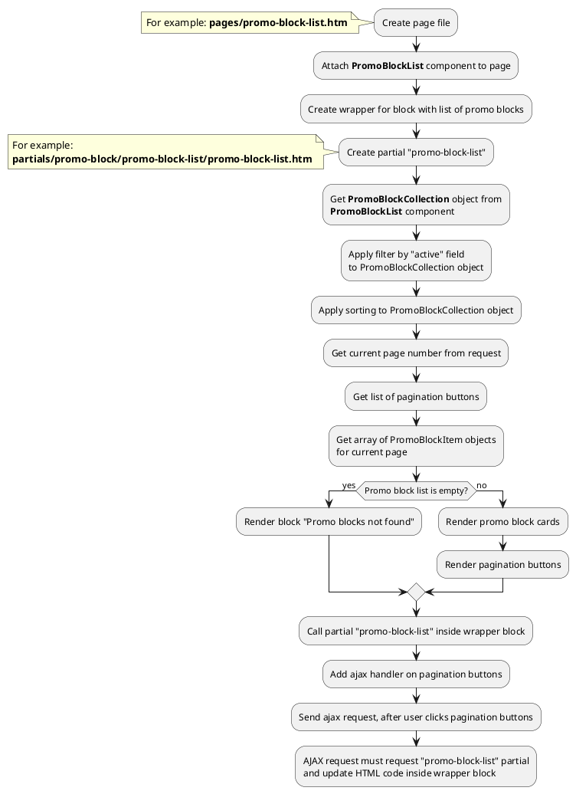

## Example {{ i }}: Promo block list with pagination

### {{ i }}.1 Task

Create simple page with promo block list.
Promo block list must have pagination block.

### {{ i }}.2 How can i do it?

> Example uses {{ component.link('promo-block-list') }} component.
Component method returns {{ get_collection('promo-block').link() }} class object.
All available methods of **PromoBlockCollection** class you can find in {{ get_collection('promo-block').link('section') }}.

> You can find more information about **Pagination** component {{ get_module('pagination').link('here') }} 

### {{ i }}.3 Source code

{{ get_module('promo-block').example('pages/promo-block-list-1.htm')|raw }}

{{ get_module('promo-block').example('partials/promo-block/promo-block-list/promo-block-list-1.htm')|raw }}

{{ get_module('promo-block').example('partials/promo-block/promo-block-card/promo-block-card-1.htm')|raw }}

{{ get_module('pagination').example('partials/pagination/pagination-1.htm')|raw }}