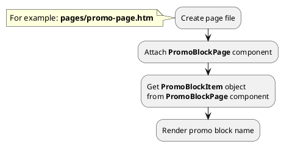

## Example {{ i }}: Promo block page

### {{ i }}.1 Task

Create simple promo block page and render promo block name.

### {{ i }}.2 How can i do it?

> Example uses {{ get_component('promo-block').link('promo-block-page') }} component.
Component method returns {{ get_item('promo-block').link() }} class object.
All available fields and methods of **PromoBlockItem** class you can find in {{ get_item('promo-block').link('section') }}.

### {{ i }}.3 Source code

{{ get_module('promo-block').example('pages/promo-page-1.htm')|raw }}
