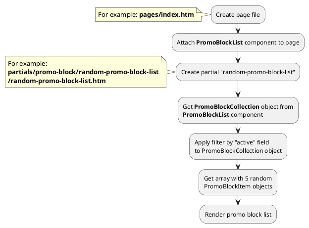

## Example {{ i }}: Random promo block list

### {{ i }}.1 Task

Create simple block with random 5 promo block list on index page.

### {{ i }}.2 How can i do it?

> Example uses {{ component.link('promo-block-list') }} component.
Component method returns {{ collection.link() }} class object.
All available methods of **PromoBlockCollection** class you can find in {{ collection.link('section') }}.

### {{ i }}.3 Source code

{{ get_module('promo-block').example('pages/index-1.htm')|raw }}

{{ get_module('promo-block').example('partials/promo-block/random-promo-block-list/random-promo-block-list-1.htm')|raw }}

{{ get_module('promo-block').example('partials/promo-block/promo-block-card/promo-block-card-1.htm')|raw }}