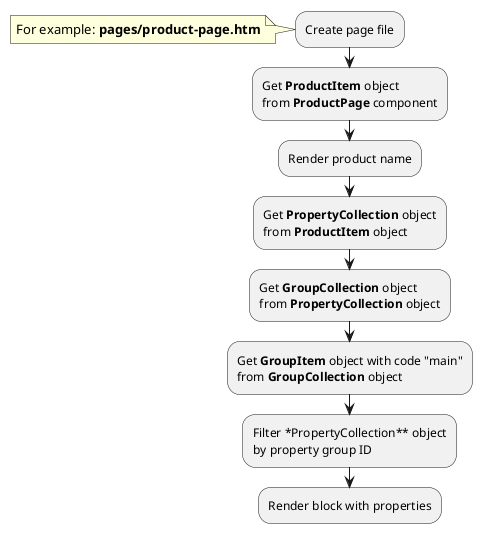

## Example {{ i }}: Render property group with code "main" 

### {{ i }}.1 Task

Create simple product page and render block with product properties from group with code 'main'.

### {{ i }}.2 How can i do it?

### {{ i }}.3 Source code

{{ get_module('property-group').example('pages/product-page-1.htm')|raw }}