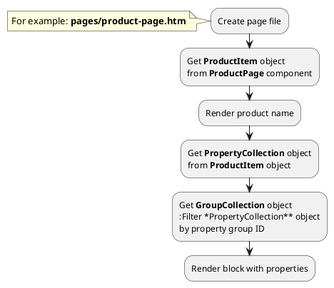

## Example {{ i }}: Render properties separated by groups

### {{ i }}.1 Task

Create simple product page and render block with product properties separated by groups.

For example, your block might look like this:

### {{ i }}.2 How can i do it?

### {{ i }}.3 Source code

{{ get_module('property-group').example('pages/product-page-2.htm')|raw }}
