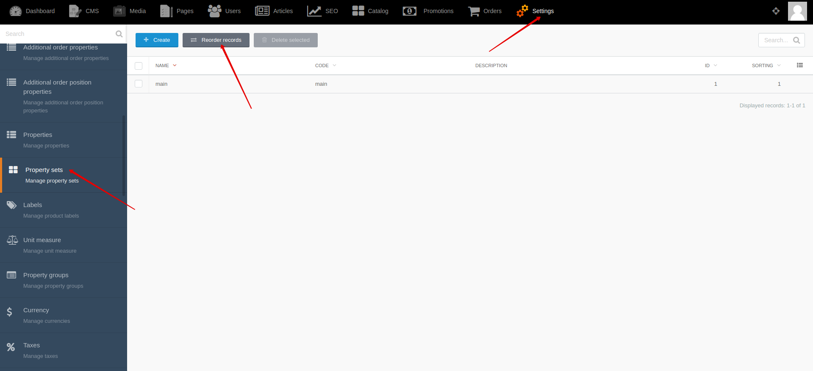
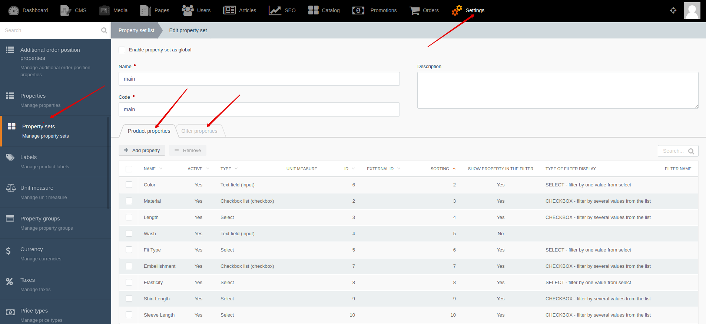




{{ parent() }}

The "Property Set" module allows you to create property sets and attach them to categories.
A set of properties can be enabled globally.
Then the global property set will be displayed for all products.

## Backend

You can create and edit property sets by going to **Backend -> Settings-> Property sets**

You can change sorting of property sets by going to **Backend -> Settings-> Property sets -> Reorder records**

You can attach property sets with product and offer properties by going to **Backend -> Settings-> Property sets -> Create/Edit**

