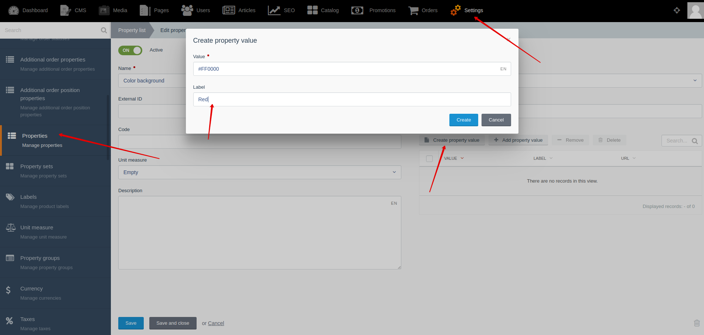
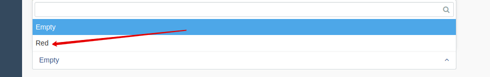




{{ parent() }}

The "Property Values" module allows you to fill in property values of products and offers ​​in the backend and display them in the frontend.

For some types of properties, you can specify a list of available values.
For property values, you can specify value and label (optional).
 The label is used only to display the property value in backend.
 
For example:
* Value = "#FF000"
* Label = "Red"

Property value **in backend** is:

When you get the property value **in template**, you get the value == **"#FF000"**

