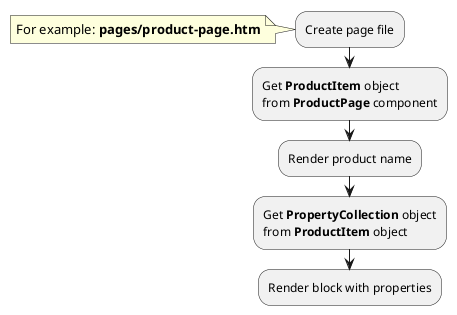

## Example {{ i }}: Render properties

### {{ i }}.1 Task

Create simple product page and render block with product properties.

### {{ i }}.2 How can i do it?

### {{ i }}.3 Source code

{{ get_module('property').example('pages/product-page-1.htm')|raw }}