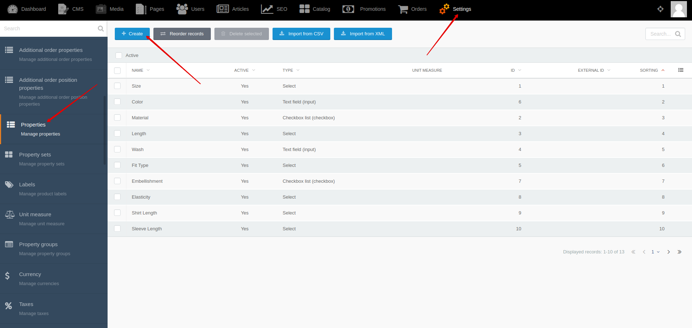
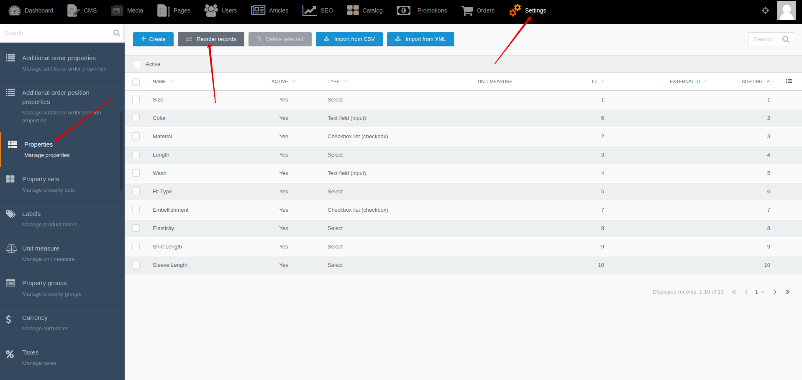




{{ parent() }}

The "Property" module allows you to render product and offer properties in different parts of the product page or product card.
You can use {{ get_module('property-group').link('property groups') }} to display properties in different parts of the product page.

You can display the offer selection block on the product page using the properties of the offers.

## Backend

You can create and edit properties by going to **Backend -> Settings -> Properties**

You can change sorting of properties by going to **Backend -> Settings -> Properties -> Reorder records**

## Import

You can import properties from XML and CSV files.
You can use [events](modules/property/event/event#event-list-property), that allows you to extend import data.
 
> You can learn more about importing from [XML](import/import-from-xml/home.md#import-from-xml) and [CSV](import/import-from-csv/home.md#import-from-csv) files in [section](import/import-from-xml/home.md#import-from-xml).


