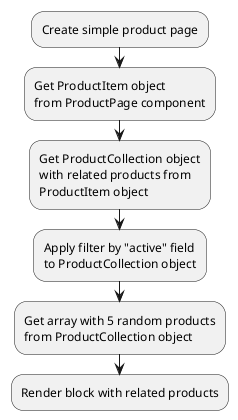

[Back to modules](modules/home.md)

[Home](modules/related-products/home.md)
• Examples

# Examples: Related products

!> **Attention!** We recommend that you read [Architecture](architecture/architecture), [ElementItem class](architecture/item-class/item-class.md),
[ElementCollection class](architecture/collection-class/collection-class.md) sections for complete understanding of  project architecture.

## Example 1: Related products on product page

### 1.1 Task

Create simple product page and render block with 5 random related products.

> Block with related products can look like any block with product list.
Block can be simple (for example: slider with 5 random related products).
Block can be complicated (contain searching, filtering, sorting, pagination).

### 1.2 How can i do it?

!> Related products available with [Related products for Shopaholic](plugins/home.md#related-products-for-shopaholic) plugin



### 1.3 Source code

Simple example of product page.

File: **pages/product.htm**
```twig
title = "Product page"
url = "/product/:slug"
layout = "main"
is_hidden = 0

[ProductPage]
slug = "{{ :slug }}"
slug_required = 1
smart_url_check = 1
skip_error = 0
==

{# Get product item #}


<div data-id="{{ obProduct.id }}" itemscope itemtype="http://schema.org/Product">
    <h1 itemprop="name">{{ obProduct.name }}</h1>
</div>

{# Get related products + apply filder by "active" field #}



<div>
    <span>Related products</span>
    {# Render product list #}
    <ul>
        
            <li></li>
        
    </ul>
</div>

```

[Home](modules/related-products/home.md)
• Examples

[Back to modules](modules/home.md)