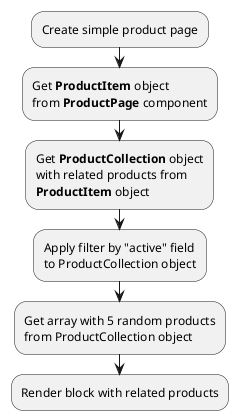

## Example {{ i }}: Related products on product page

### {{ i }}.1 Task

Create simple product page and render block with 5 random related products.

> Block with related products can look like any block with product list.
Block can be simple (for example: slider with 5 random related products).
Block can be complicated (contain searching, filtering, sorting, pagination).

### {{ i }}.2 How can i do it?

!> Related products {{ 'related-products'|available_with|lcfirst }}

### {{ i }}.3 Source code

Simple example of product page.

{{ get_module('product').example('pages/product-page-6.htm')|raw }}

{{ get_module('product').example('partials/product/product-card/product-card-1.htm')|raw }}
