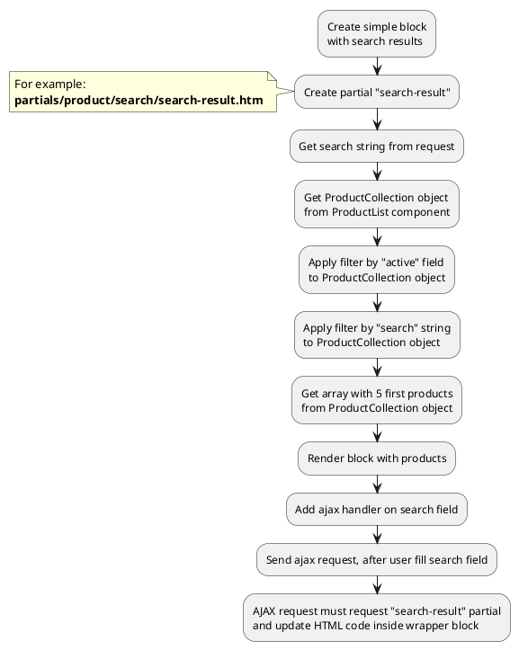
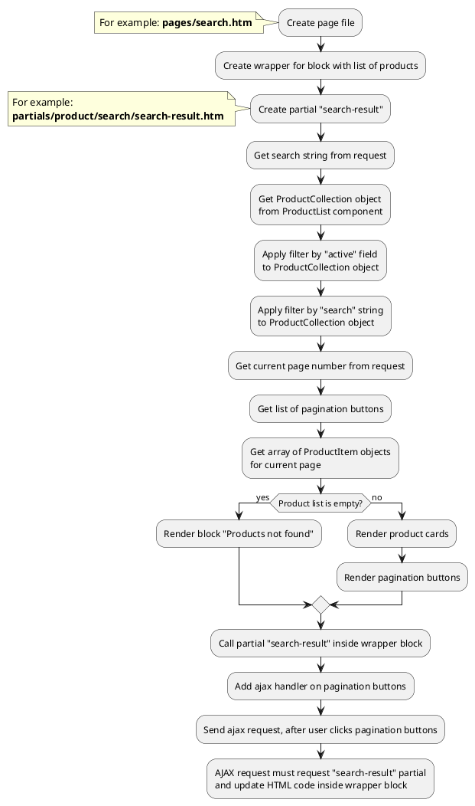

[Back to modules](modules/home.md)

[Home](modules/search/home.md)
• Examples
• [Sphinx](modules/search/sphinx/sphinx.md)

# Examples: Search {docsify-ignore-all}

!> **Attention!** We recommend that you read [Architecture](architecture/architecture), [ElementItem class](architecture/item-class/item-class.md),
[ElementCollection class](architecture/collection-class/collection-class.md) sections for complete understanding of  project architecture.

* [Example 1: Simple search results](#example-1-simple-search-results)
* [Example 2: Search page](#example-2-search-page)

## Example 1: Simple search results

### 1.1 Task

Create simple block with serch results and render 5 first products.

### 1.2 How can i do it?

!> Search method available with
[Search for Shopaholic](plugins/home.md#search-for-shopaholic) and
[Sphinx for Shopaholic](plugins/home.md#sphinx-for-shopaholic)
plugins

> Example uses [ProductList](modules/product/component/component.md#productlist) component.
Component method returns [ProductCollection](modules/product/collection/collection.md#productcollection) class object.
All available methods of **ProductCollection** class you can find in [section](modules/product/collection/collection.md#productcollection).
Block can be complicated (contain filtering, pagination)



### 1.3 Source code

Simple example of block with search results.

File: **partials/product/search/search-result.htm**
```twig
[ProductList]
sorting = "popularity|desc"
==
{# Get search string #}


{# Get product collection #}


{# Get first 5 products #}



    {# Render product list #}
    <ul>
        
            <li></li>
        
    </ul>

    <div>
        Products not found
    </div>

```

## Example 2: Search page

### 2.1 Task
Create simple search page and render product list.
Product list must have pagination block.

### 2.2 How can i do it?

!> Search method available with
[Search for Shopaholic](plugins/home.md#search-for-shopaholic) and
[Sphinx for Shopaholic](plugins/home.md#sphinx-for-shopaholic)
plugins

> Example uses [ProductList](modules/product/component/component.md#productlist) component.
Component method returns [ProductCollection](modules/product/collection/collection.md#productcollection) class object.
All available methods of **ProductCollection** class you can find in [section](modules/product/collection/collection.md#productcollection).
Block can be complicated (contain filtering, pagination)



### 2.3 Source code

File: **pages/search.htm**
```twig
title = "Search"
url = "/search"
layout = "main"
is_hidden = 0

[ProductList]
sorting = "popularity|desc"

[Pagination]
count_per_page = 15
pagination_limit = 5
active_class = ""
button_list = "first,first-more,main,last-more,last"
first_button_name = "First"
first_button_limit = 3
first_button_number = 1
first-more_button_name = "..."
first-more_button_limit = 4
prev_button_name = "Prev"
prev_button_limit = 1
prev-more_button_name = "..."
prev-more_button_limit = 1
next-more_button_name = "..."
next-more_button_limit = 1
next_button_name = "Next"
next_button_limit = 1
last-more_button_name = "..."
last-more_button_limit = 4
last_button_name = "Last"
last_button_limit = 3
last_button_number = 1
==
<div class="search-wrapper">
    
</div>
```

File: **partials/product/search/search-result.htm**
```twig
{# Get search string #}


{# Get product collection #}


{# Get array with pagination buttons #}



{# Apply pagination to product collection and get array with product items #}



    {# Render product list #}
    <ul>
        
            <li></li>
        
    </ul>
    
    {# Render pagination buttons #}
    
        
            <a href="{{ obCategory.getPageUrl() }}?page={{ arPagination.value }}" class="{{ arPagination.class }}">
                {{ arPagination.name }}
            </a>
        
    

    <div>
        Products not found
    </div>

```

[Home](modules/search/home.md)
• Examples
• [Sphinx](modules/search/sphinx/sphinx.md)

[Back to modules](modules/home.md)