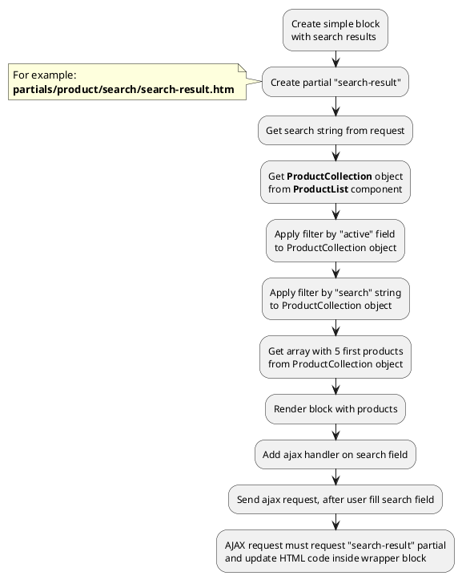

## Example {{ i }}: Simple search results

### {{ i }}.1 Task

Create simple block with serch results and render 5 first products.

### {{ i }}.2 How can i do it?

!> Search method {{ ['search', 'sphinx']|available_with|lcfirst }}

> Example uses {{ get_component('product').link('product-list') }} component.
Component method returns {{ get_collection('product').link() }} class object.
All available methods of **ProductCollection** class you can find in {{ get_collection('product').link('section') }}.
Block can be complicated (contain filtering, pagination)

### {{ i }}.3 Source code

Simple example of block with search results.

{{ get_module('product').example('partials/product/search/search-result-1.htm')|raw }}

{{ get_module('product').example('partials/product/product-card/product-card-1.htm')|raw }}