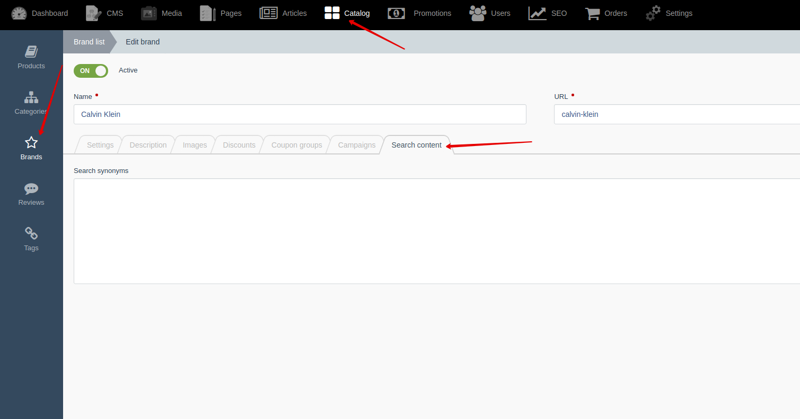
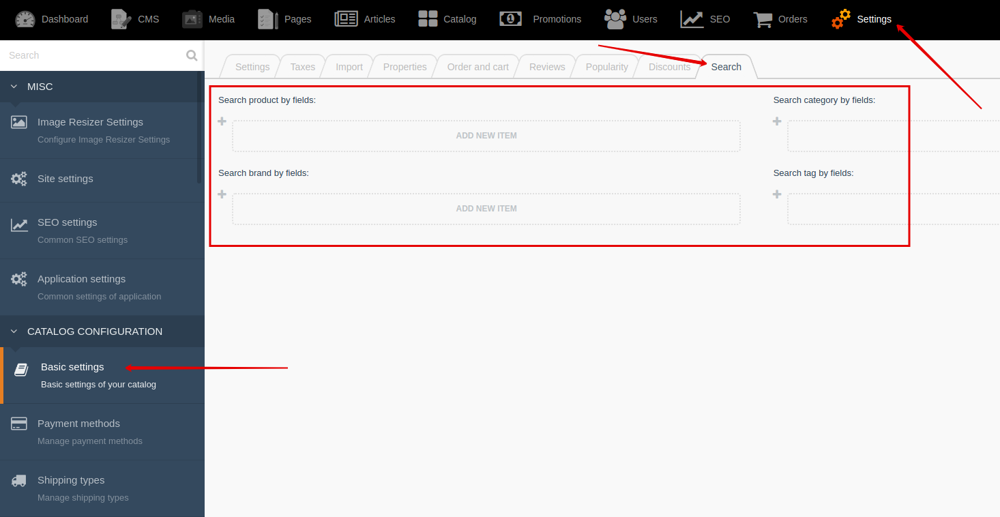

[Back to modules](modules/home.md)

Home
• [Examples](modules/search/examples/examples.md)
• [Sphinx](modules/search/sphinx/sphinx.md)

# Search {docsify-ignore-all}

!> **Attention!**  We recommend that you read [Architecture](home.md#architecture), [ElementItem class](item-class/item-class.md),
[ElementCollection class](collection-class/collection-class.md) sections for complete understanding of  project architecture.

> Module available with [Search for Shopaholic](plugins/home#search-for-shopaholic) plugin.

## Search fields

Search for Shopaholic plugin adds **search_synonym** and **search_content** fields to
[Brand](modules/brand/model/model), [Category](modules/category/model/model),
[Offer](modules/offer/model/model), [Product](modules/product/model/model)
models.
**search_synonym** field is available in backend and allows to add search synonyms
to certain keywords so customers can easily find elements by typing semantically related phrases.
**search_content** filed isn't available in backend. **search_content** field should be filled in automatically. 

## Settings

You can configure search settings: list of fields that will use in search. 
Go to **Backend -> Application settings -> "Search" tab**

Home
• [Examples](modules/search/examples/examples.md)
• [Sphinx](modules/search/sphinx/sphinx.md)

[Back to modules](modules/home.md)
