[Back to modules](modules/home.md)

# Settings

!> **Attention!**  We recommend that you read [Architecture](home.md#architecture), [ElementItem class](item-class/item-class.md),
[ElementCollection class](collection-class/collection-class.md) sections for complete understanding of  project architecture.

## Active products

Often projects require you to hide products that do not have active offers.
You can enable additional check when you get list of active products.
If this setting is enabled, list of active products will contain only those products that have active offers.

Go to **Backend -> Settings -> Basic Settings**
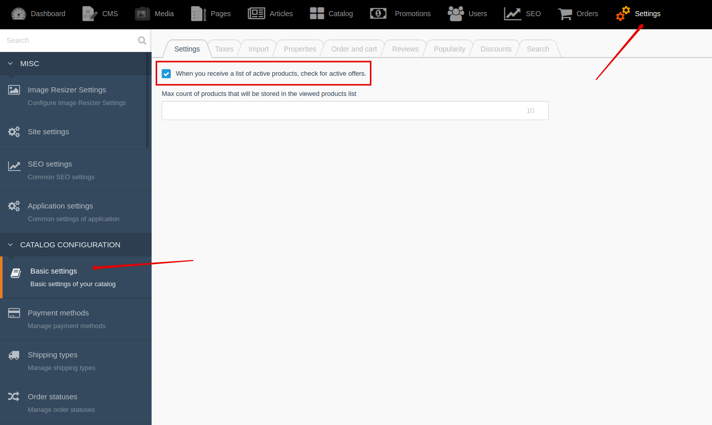

## Cart

You can set life time of cart ID in cookie.

Go to **Backend -> Settings -> Basic settings -> "Order and cart" tab**
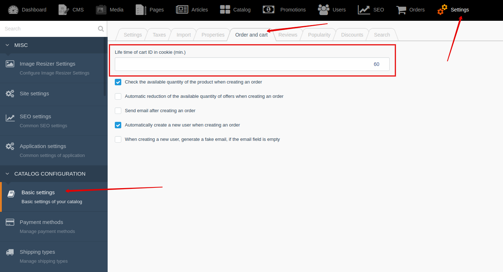

## Discounts

For big catalog, you can use queues to reduce server load during calculation of prices and applying discounts.

Go to **Backend -> Settings -> Basic settings -> "Discounts" tab**
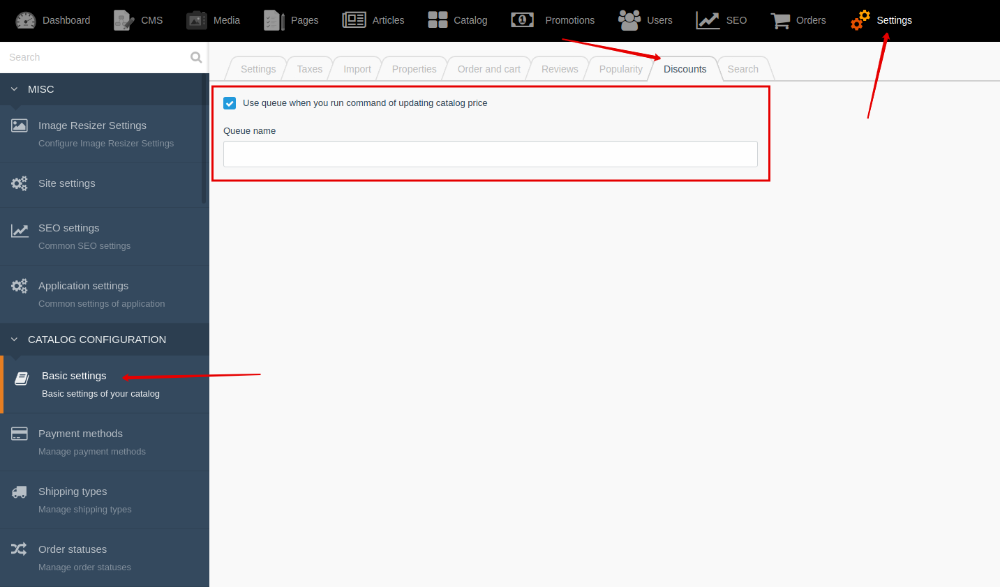

## Import from CSV

You can hide import buttons in "Basic settings".

Go to **Backend -> Settings -> Basic settings -> "Import" tab**
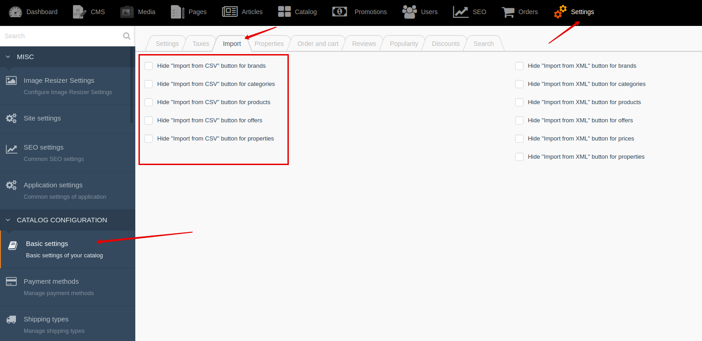

## Import from XML

For big catalog, you can use queues to reduce server load during import.
You can enable queues in **"Application settings"**.

Go to **Backend -> Settings -> Application settings -> "Import" tab**
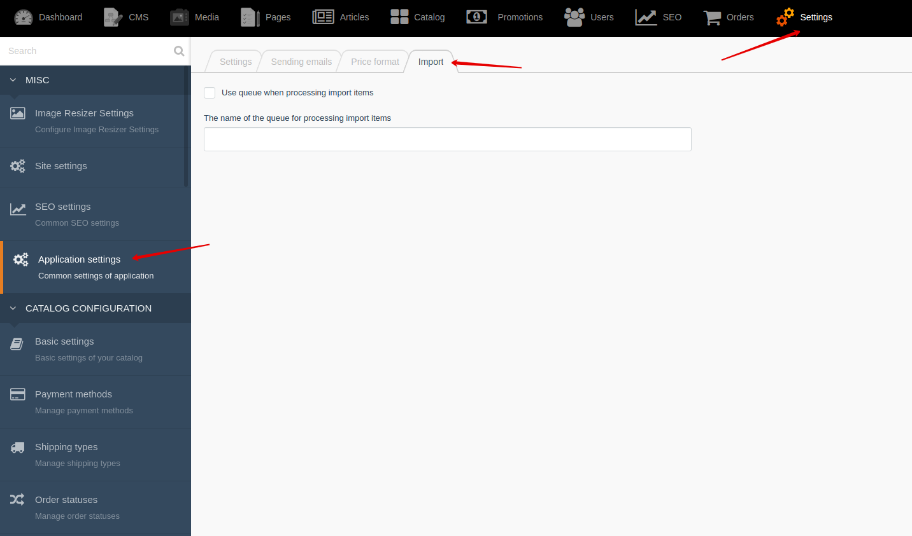

You can hide import buttons in "Basic settings".

Go to **Backend -> Settings -> Basic settings -> "Import" tab**
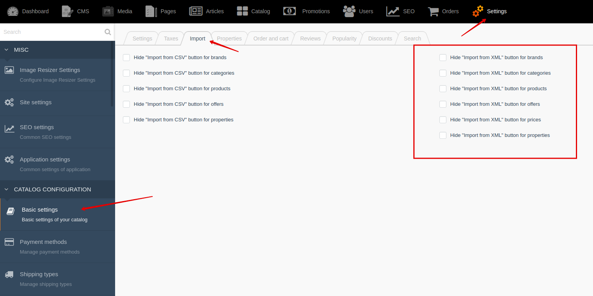

## Orders

You can change order creation logic.

Go to **Backend -> Settings -> Basic settings -> "Order and cart" tab**
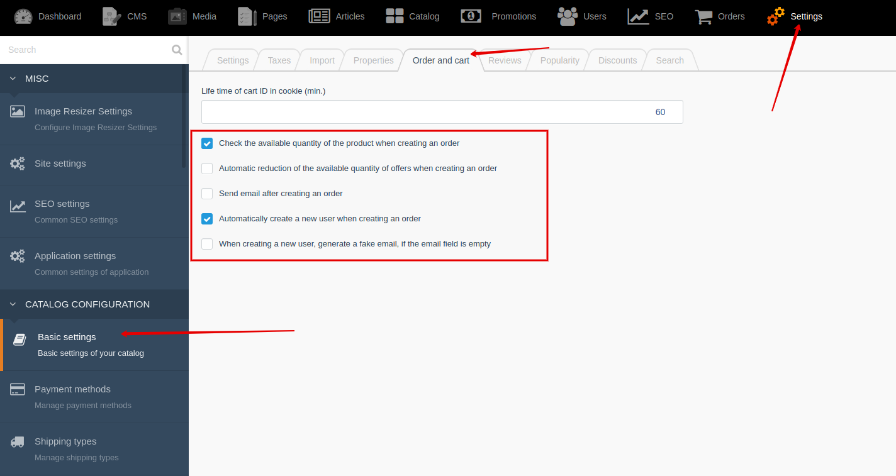

## Popularity

You can configure increase of product popularity.

Go to **Backend -> Settings -> Basic settings -> "Popularity" tab**
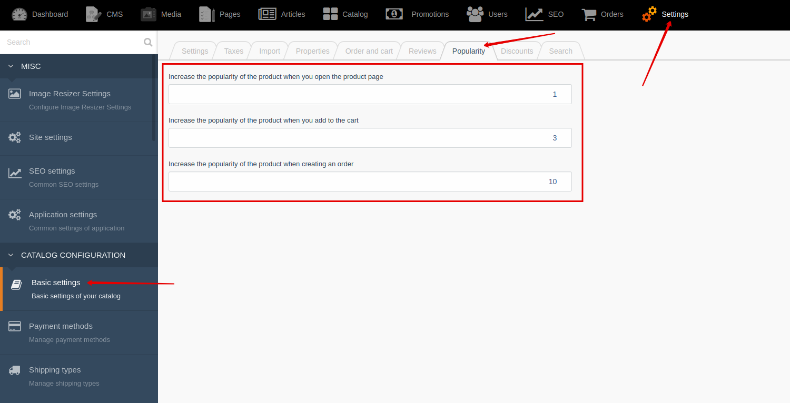 

## Price format

You can set **price format** in Backend -> Settings -> Application settings -> "Price format" tab

## Properties

You can change logic of generation "slug" value for property values.

Go to **Backend -> Settings -> Basic settings -> "Properties" tab**
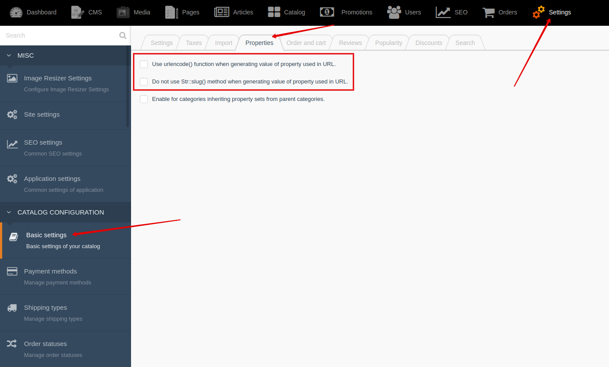

## Property sets

You can enable for categories inheriting property sets from parent categories.

Go to **Backend -> Settings -> Basic settings -> "Properties" tab**
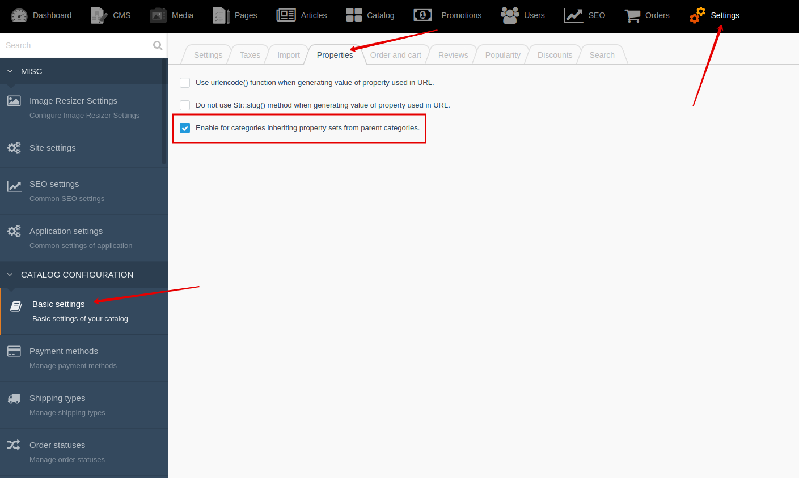

## Reviews

You can set rating range and automatic activation of reviews after creation.

Go to **Backend -> Settings -> Basic settings -> "Reviews" tab**
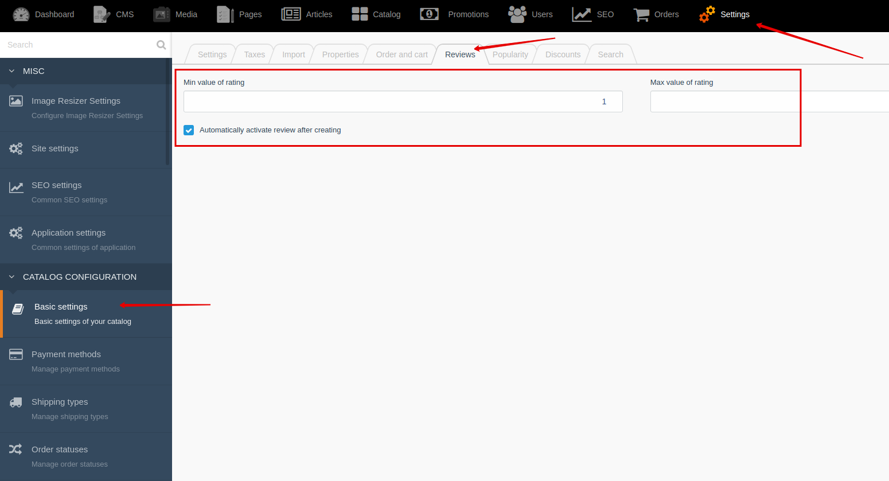

## Search

You can configure search settings: list of fields that will use in search.

Go to **Backend -> Application settings -> "Search" tab**

## Sending emails with queues

> Sending emails is hard and long operation.
We recommend that you always enable queues when server allows it.

You can enable "Sending emails with queues" in "Application settings".

Go to **Backend -> Application settings -> "Sending emails" tab**
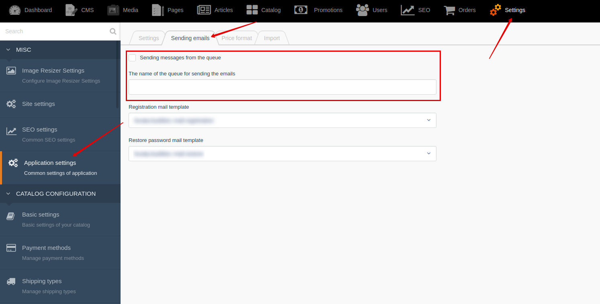

## Taxes

You can flexibly configure taxes in your project.

Go to **Backend -> Settings -> Basic settings -> "Taxes" tab**

For example: **offer price is 39.99, tax percent is 20**.

||Backend price|Price without tax|Tax|Price with tax|
|---|---|---|---|---|
|Price includes taxes|**39.99**|33.33|6.66|**39.99**|
|Price does not includes taxes|**39.99**|**39.99**|8|47.99|

Example of calculation of discount after applying **coupon -7%**:

1. Price includes taxes

||Backend price|Calculation|Price without tax|Tax|Price with tax|
|---|---|---|---|---|---|
|Discount is deducted from backend price (default)|**39.99**|39.99 - 7% = 37.19|30.99|6.2|37.19|
|Discount is deducted from price without taxes|**39.99**|33.33 - 7% = 31|31|6.2|37.2|
|Discount is deducted from price with taxes|**39.99**|39.99 - 7% = 37.19|30.99|6.2|37.19|

1. Price does not includes taxes

||Backend price|Calculation|Price without tax|Tax|Price with tax|
|---|---|---|---|---|---|
|Discount is deducted from backend price (default)|**39.99**|39.99 - 7% = 37.19|37.19|7.44|44.63|
|Discount is deducted from price without taxes|**39.99**|39.99 - 7% = 37.19|37.19|7.44|44.63|
|Discount is deducted from price with taxes|**39.99**|47.99 - 7% = 44.63|37.19|7.44|44.63|

## Translatable URL

You can enable "Translatable URL" in "Application settings".

!> "Translatable URL" only works, if [Translate](https://octobercms.com/plugin/rainlab-translate) plugin is installed.

Go to **Backend -> Application settings -> "Settings" tab**
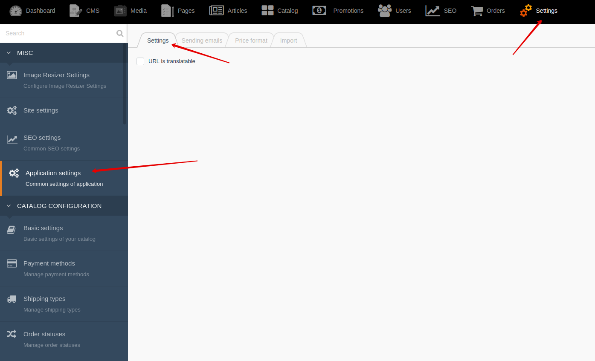

## Viewed products

You can set limit of products that will be stored in viewed products list.

Go to **Backend -> Settings -> Basic Settings**
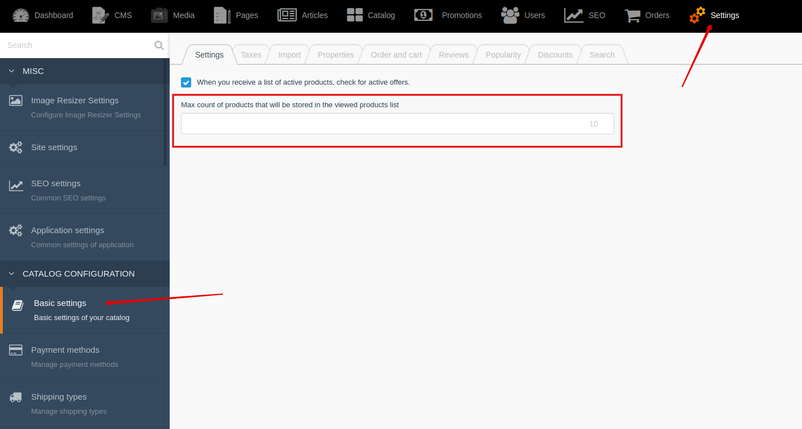

[Back to modules](modules/home.md)