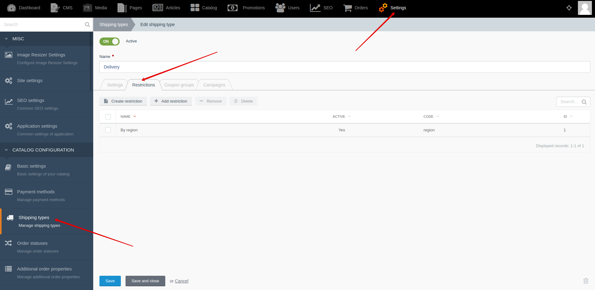




{{ parent() }}

Shipping restrictions give you the opportunity to have different lists of shipping types.
For example, user may see different lists of shipping types for different regions or for different price ranges.

## Backend

You can create and edit shipping restrictions by going to **Backend -> Settings -> Shipping types -> "Restriction" tab**


