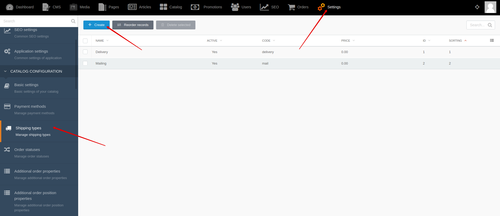
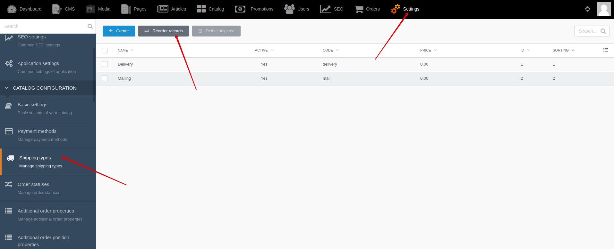




{{ parent() }}

Shipping types allows the user to choose their preferred shipping type before creating an order.
The shipping type can be different: pickup, courier delivery, mail delivery.
The shipping type may be linked with one of the delivery service.

## Backend

You can create and edit shipping types by going to **Backend -> Settings -> Shipping types**

You can change sorting of shipping types by going to **Backend -> Settings -> Shipping types -> Reorder records**

