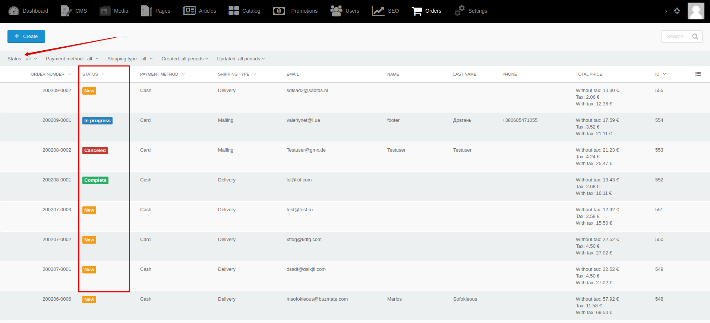




{{ parent() }}

You can create order statuses that are necessary for your status scheme.
You can hide some statuses from buyers or show customers alternative status.
For example:

|Backend status|Customer status|
|---|---|
|New|New|
|In progress|In progress|
|Transferred to the warehouse|Delivering|
|Waiting for shipment to delivery service|Delivering|
|Sent by delivery service|Delivering|
|Delivered|Delivered|
|Need a review|Completed|
|Completed|Completed|

## Backend

You can create and edit statuses by going to **Backend -> Settings -> Order statuses**

You can change sorting of statuses by going to **Backend -> Settings -> Order statuses -> Reorder records**

You can filter the list of orders by status by going to **Backend -> Orders**

You can change the order status by going to **Backend -> Orders -> Edit order**

