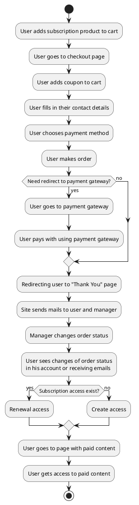
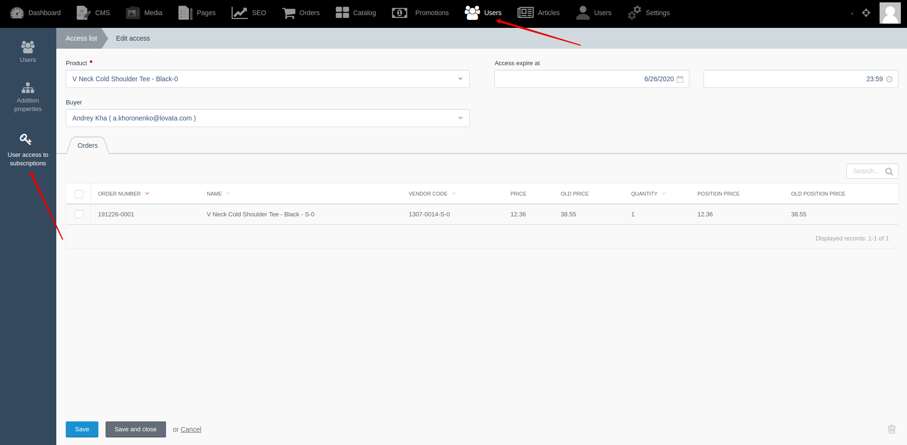




{{ parent() }}

## Introduction

"Subscription access" module contains list of purchased user subscriptions and will allow you to check user access to subscription products.
Module allows you to renewal user access to their subscription.

You can give access to any custom model (for example "Article" model). This will give you opportunity to give access to paid content, such as an article in paid journal.

## How it works?

## Backend

You can view and manage access to subscriptions by going to **Backend -> Users -> User access to subscriptions**.
You can renew your subscription access manually by changing "Access expire at" field.

