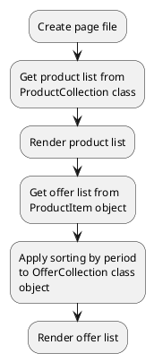

[Back to modules](modules/home.md)

[Home](modules/subscription-period/home.md)
• [Model](modules/subscription-period/model/model.md)
• [Item](modules/subscription-period/item/item.md)
• [Collection](modules/subscription-period/collection/collection.md)
• Examples
• [Extending](modules/subscription-period/extending/extending.md)

# Examples: Subscription period {docsify-ignore-all}

!> **Attention!** We recommend that you read [Architecture](architecture/architecture), [ElementItem class](architecture/item-class/item-class.md),
[ElementCollection class](architecture/collection-class/collection-class.md) sections for complete understanding of  project architecture.

* [Example 1: Render subscription product](#example-1-render-subscription-product)

## Example 1: Render subscription product

### 1.1 Task

Render product list with subscription variants.

### 1.2 How can i do it?



### 1.3 Source code

File: **pages/subscription.htm**
```twig
title = "Subscription"
url = "/subscriptions"
layout = "main"
is_hidden = 0

[ProductList]
sorting = "popularity|desc"
==

{# Get active product list #}



  {# Get offer list #}
  
  {# Render offer list #}
  
    <div>
      <span>{{ obOffer.name }}</span>
      <span>{{ obOffer.subscription_period.name }}</span>
    </div>
  

```

[Home](modules/subscription-period/home.md)
• [Model](modules/subscription-period/model/model.md)
• [Item](modules/subscription-period/item/item.md)
• [Collection](modules/subscription-period/collection/collection.md)
• Examples
• [Extending](modules/subscription-period/extending/extending.md)

[Back to modules](modules/home.md)
