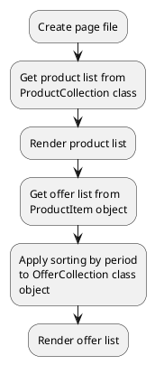

## Example {{ i }}: Render subscription product

### {{ i }}.1 Task

Render product list with subscription variants.

### {{ i }}.2 How can i do it?



### {{ i }}.3 Source code

File: **pages/subscription.htm**

```twig
title = "Subscription"
url = "/subscriptions"
layout = "main"
is_hidden = 0

[ProductList]
sorting = "popularity|desc"
==

{# Get active product list #}



  {# Get offer list #}
  
  {# Render offer list #}
  
    <div>
      <span>{{ obOffer.name }}</span>
      <span>{{ obOffer.subscription_period.name }}</span>
    </div>
  

```
