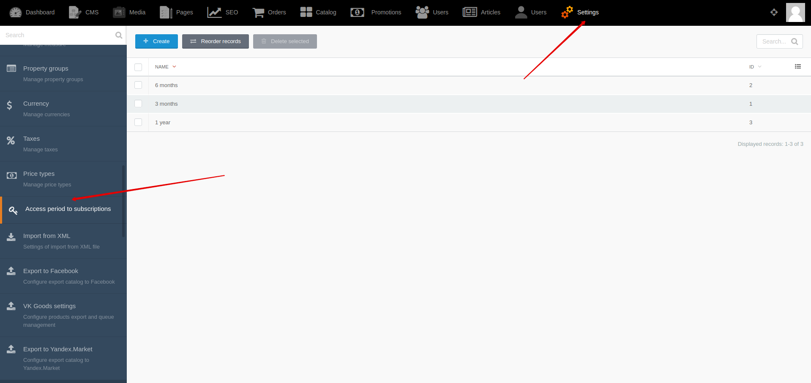
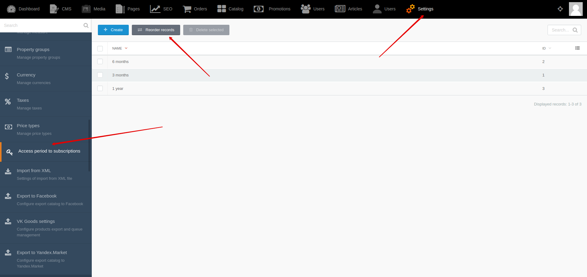
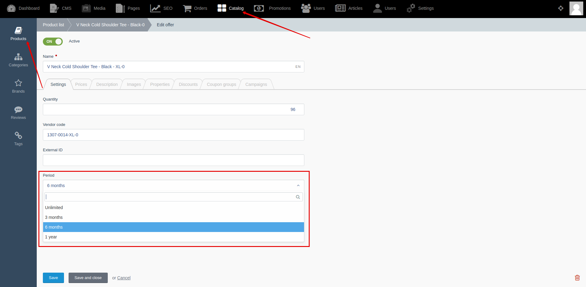

[Back to modules](modules/home.md)

Home
• [Model](modules/subscription-period/model/model.md)
• [Item](modules/subscription-period/item/item.md)
• [Collection](modules/subscription-period/collection/collection.md)
• [Examples](modules/subscription-period/examples/examples.md)
• [Extending](modules/subscription-period/extending/extending.md)

# Subscription period {docsify-ignore-all}

!> **Attention!**  We recommend that you read [Architecture](architecture/architecture), [ElementItem class](architecture/item-class/item-class.md),
[ElementCollection class](architecture/collection-class/collection-class.md) sections for complete understanding of  project architecture.

> Module available with [Subscriptions for Shopaholic](plugins/home#subscriptions-for-shopaholic) plugin.

## Introduction

You can create an expiration period for access to subscriptions. You can link offers and periods.

## Backend

You can create and edit access period to subscriptions by going to **Backend -> Settings -> Access period to subscriptions**

You can change sorting of access period to subscriptions by going to **Backend -> Settings -> Access period to subscriptions -> Reorder records**

You can set an access period for offers of subscription by going to **Backend -> Catalog -> Products -> Edit product -> Edit offer -> "Settings" tab -> "Period" select**

Home
• [Model](modules/subscription-period/model/model.md)
• [Item](modules/subscription-period/item/item.md)
• [Collection](modules/subscription-period/collection/collection.md)
• [Examples](modules/subscription-period/examples/examples.md)
• [Extending](modules/subscription-period/extending/extending.md)

[Back to modules](modules/home.md)