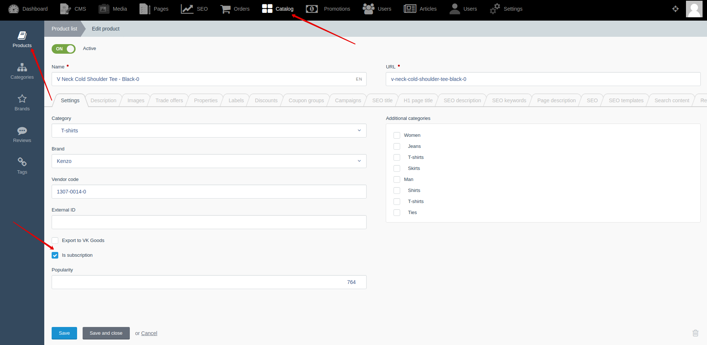
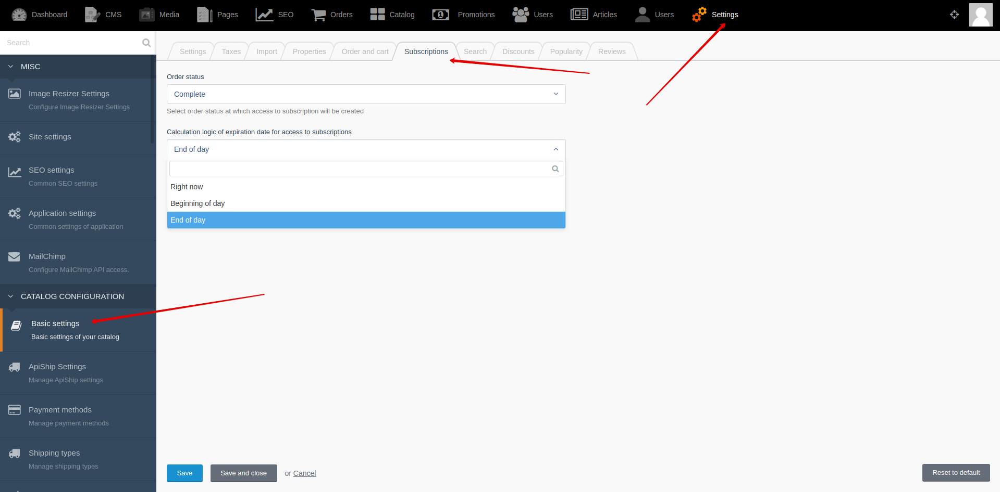

## Example {{ i }}: Create subscription

### {{ i }}.1 Task

Create subscription product with offers. Create order with subscription product.
Check user access to subscription. Product must provide access to article with ID == 12

### {{ i }}.2 Solution

**Step 1:** Create access period to subscription

You can create and edit access period to subscriptions by going to **Backend -> Settings -> Access period to subscriptions**


**Step 2:** Create subscription product

You can set product as subscription by going to **Backend -> Catalog -> Products -> Edit product -> "Settings" tab -> "Is subscription" checkbox**



**Step 3:** Create offer for subscription product

You can set an access period for offers of subscription by going to **Backend -> Catalog -> Products -> Edit product -> Edit offer -> "Settings" tab -> "Period" select**


**Step 4:** Add subscription product to cart

You will need to add offer with quantity == 1 and an array of properties. The property array must contain article ID and Article model class.
See more information about cart module in [section](modules/cart/home).

For example:
```javascript
//Prepare object with offers
let data = {
    'cart': [
        {'offer_id': 32, 'quantity': 1, 'property': {'access_element_id': 21, 'access_element_type': "Lovata\\GoodNews\\Models\\Article"}}
    ]
};

//Send ajax request and update cart items
$.request('Cart::onAdd', {
    'data': data,
    'update': {'cart-items': '.cart-item-wrapper'}
});
```

**Step 5:** Create order with subscription product

See more information about order module in [section](modules/order/home).

**Step 6:** Configure settings

You can set logic for creating access to subscriptions.

Go to **Backend -> Settings -> Basic settings -> "Subscriptions" tab**


**Step 7:** Change order status

You need to change status of order that you set in step 6.
After this step, access to subscription will be created or extended for user.

**Step 8:** Check access to subscription in backend

You can view, manage access to subscriptions by going to **Backend -> Users -> User access to subscriptions**


**Step 9:** Check access to subscription in template

<!-- tabs:start -->
#### ** Lovata.Buddies **

File: **pages/index.htm**

```twig
title = "Index page"
url = "/"
layout = "main"
is_hidden = 0

[UserData]
==

{# Get user object #}


{# Check access to subscription with product ID == 5 #}

  <p>User has access</p>

  <p>User hos not access</p>

```


#### ** RainLab.User **

File: **pages/index.htm**

```twig
title = "Index page"
url = "/"
layout = "main"
is_hidden = 0
==


    <p>Hello {{ user.name }}</p>
    {# Check access to subscription with product ID == 5 #}
    
      <p>User has access</p>
    
      <p>User hos not access</p>
    

    <p>Nobody is logged in</p>

```

<!-- tabs:end -->