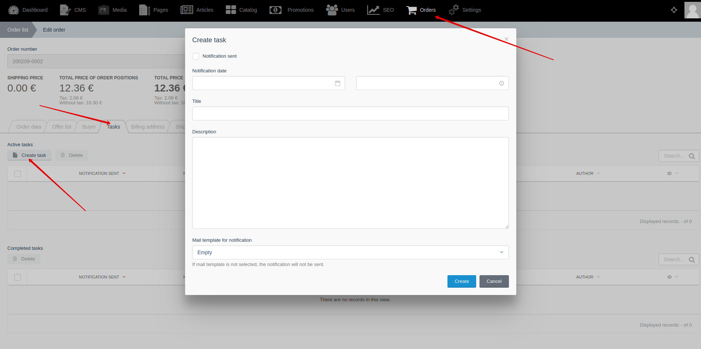
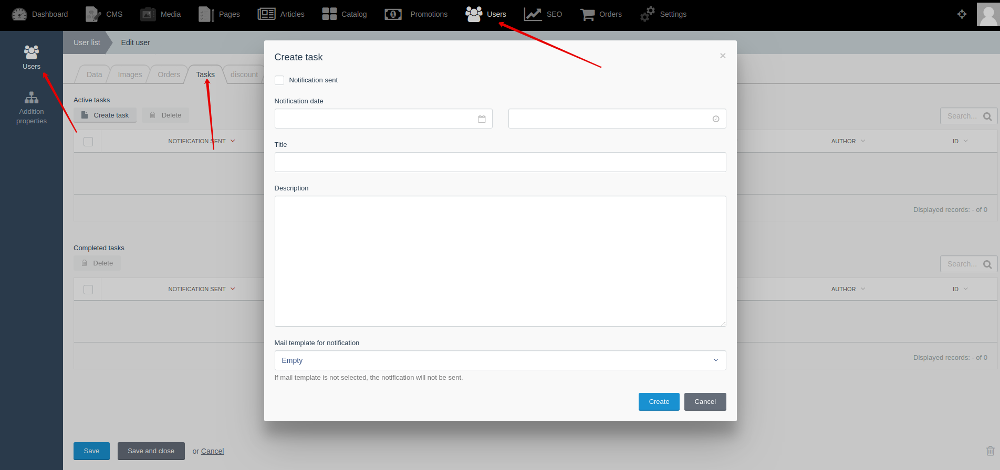




{{ parent() }}

Tasks allow you to create notes that will be linked with orders or customers.
You can set the notification date for the task.
You can assign a task to one of the managers of our project.

## Backend

You can create and edit tasks by going to **Backend -> Orders -> Edit order -> "Tasks" tab"**

You can create and edit tasks by going to **Backend -> Users -> Edit user -> "Tasks" tab"**

